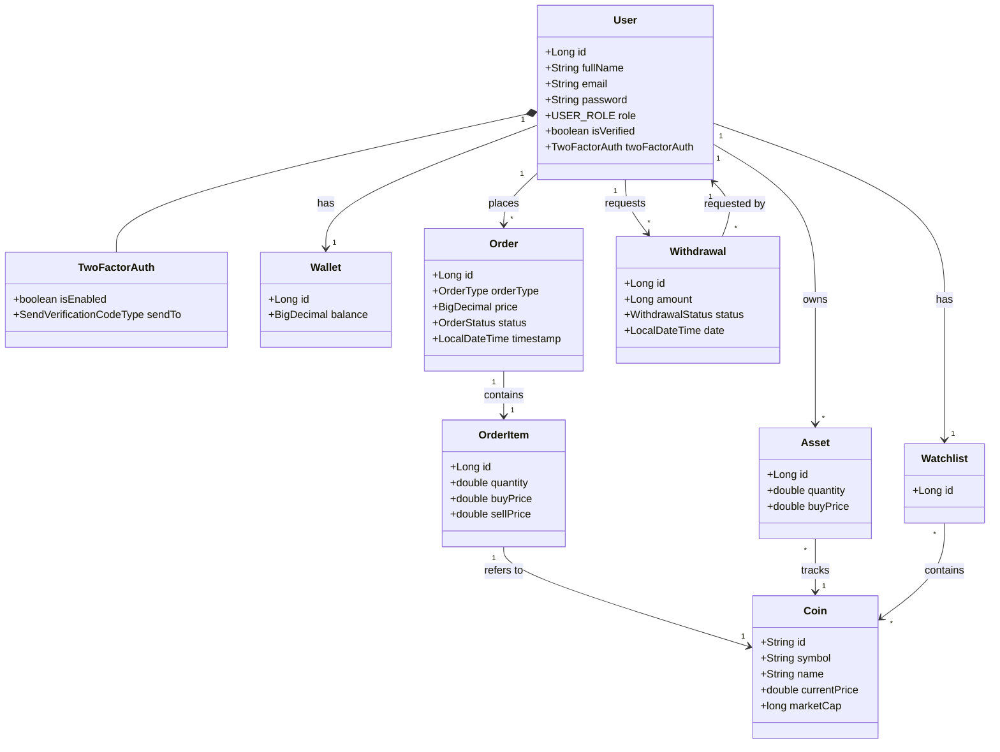

# CoinX Cryptocurrency Trading Platform - Client Documentation

## 1. Executive Summary
**CoinX** is a state-of-the-art cryptocurrency trading platform designed to provide a seamless, secure, and intuitive trading experience. Built with enterprise-grade technologies, CoinX aims to bridge the gap between complex blockchain technologies and everyday users.

## 2. Key Features
*   **Real-Time Trading**: Live market data and instant execution.
*   **Secure Wallet**: Integrated wallets for fund management.
*   **Security**: JWT authentication and Two-Factor Authentication (2FA).
*   **Portfolio**: Real-time asset tracking.

## 3. System Architecture

### Entity Relationship Diagram (Class Diagram)

## 4. User Guide
1.  **Sign Up/Login**: Secure access via Email/Password.
2.  **Deposit**: Add funds to your Wallet.
3.  **Trade**: Buy assets from the Market.
4.  **Track**: Monitor your Portfolio and Watchlist.

## 5. Technology Stack
- **Frontend**: React, Redux Toolkit, Tailwind CSS.
- **Backend**: Spring Boot 3, Java 21/25, MySQL.
- **Security**: Spring Security, JWT.

---
*Generated by CoinX Development Team*
