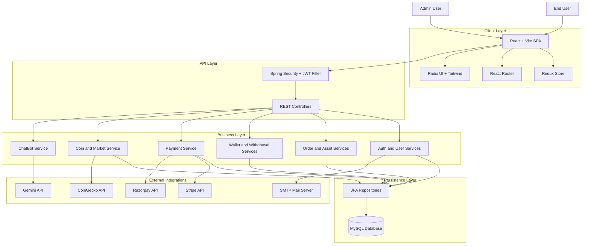
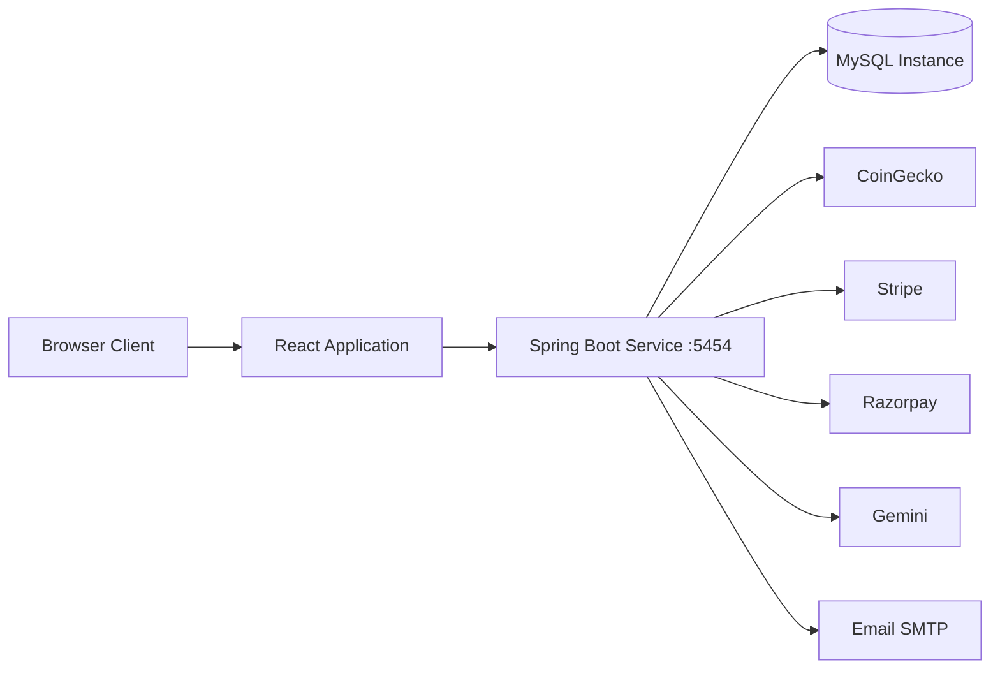
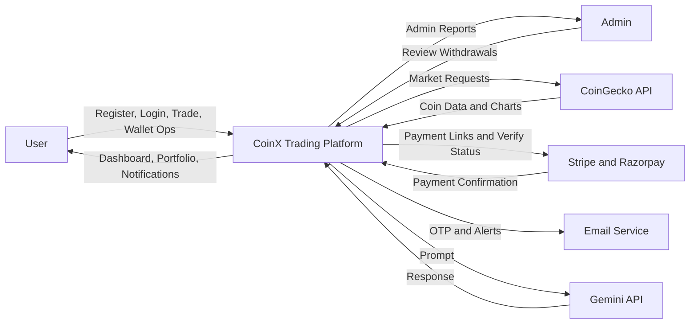
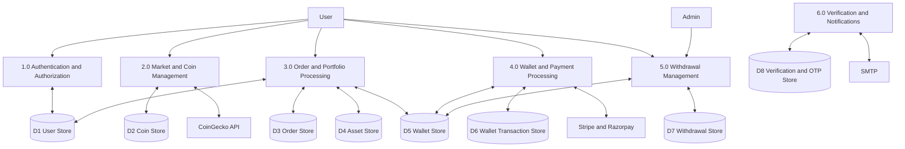
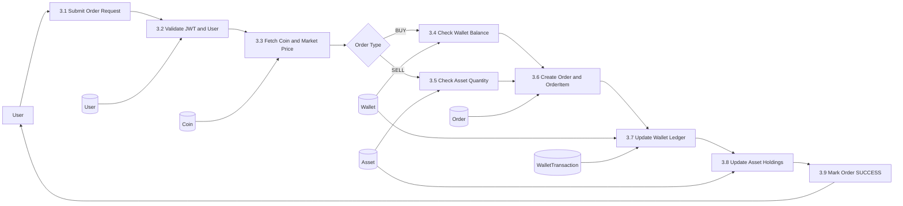
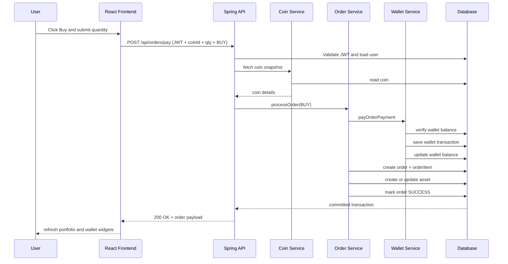
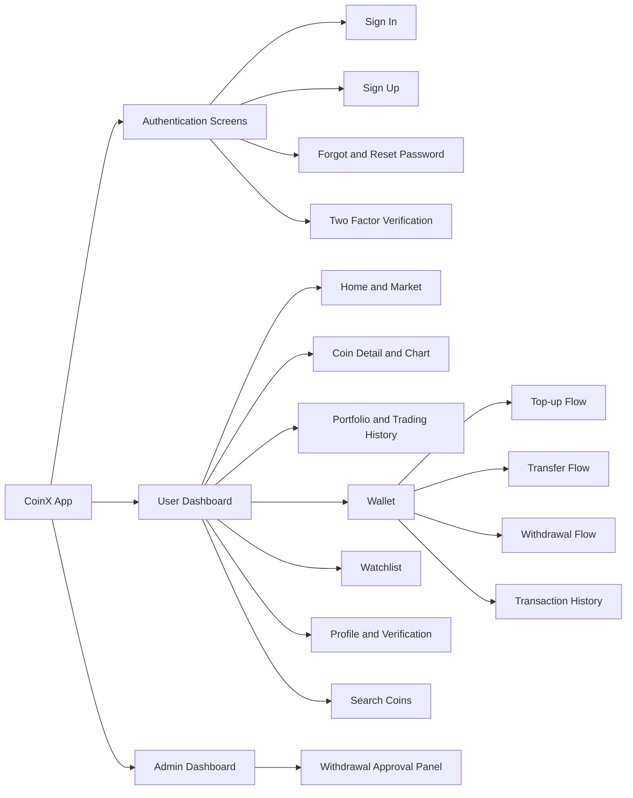
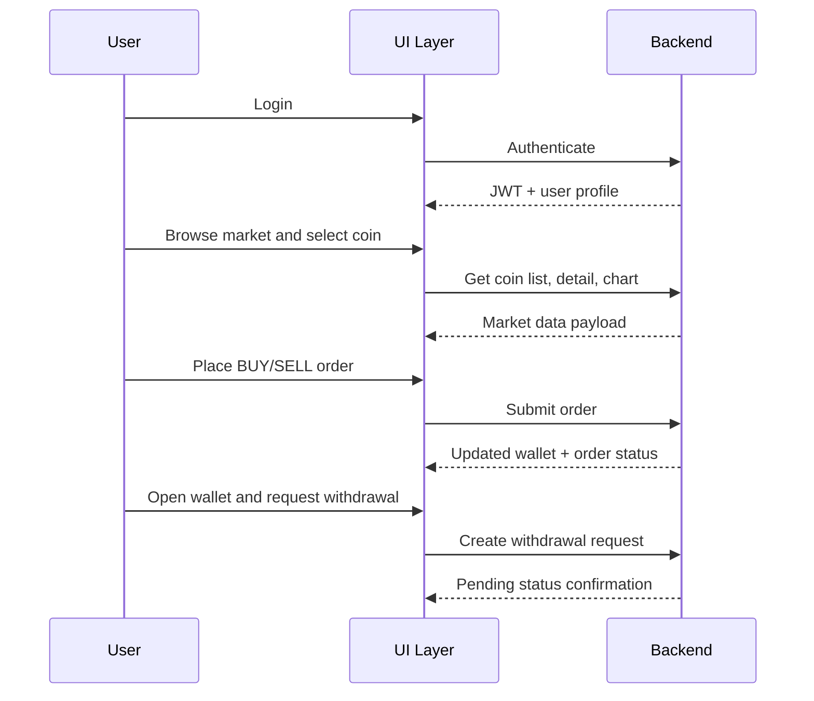

# 📈 CoinX - Cryptocurrency Trading Platform

A full-stack cryptocurrency trading platform similar to Binance, built with **Spring Boot** backend and **React** frontend. This application provides real-time trading capabilities, wallet management, portfolio tracking, and secure payment processing.

---

## Project Report Documentation

This section presents the project in academic report format with chapter-wise structure.

## Chapter 1: Introduction

### 1.1 Background of the Project
The rapid growth of digital assets has transformed cryptocurrency trading from a niche activity into a mainstream financial operation used by retail users, developers, and institutions. Modern users expect not only buy and sell capabilities, but also secure authentication, live market visibility, transaction history, portfolio insights, and reliable payment workflows. CoinX is developed in this context as a full-stack trading platform that combines a React-based user interface with a Spring Boot backend to deliver a realistic end-to-end trading experience. The project is positioned as both a functional platform and a technical demonstration of how core exchange-like modules can be designed in a layered, maintainable architecture.

### 1.2 Motivation
The primary motivation behind CoinX is to bridge the gap between simplified academic projects and practical software systems that resemble real market products. Many learning projects demonstrate isolated features such as authentication or chart rendering, but they rarely show how these features interact in a complete transaction lifecycle. This project was initiated to implement a cohesive platform where authentication, order processing, wallet updates, payment flow, and admin operations work together in a consistent manner.

A second motivation is educational depth. By building both frontend and backend modules, the project enables hands-on understanding of token-based security, role-aware routing, REST API design, transactional business logic, and integration with external providers such as CoinGecko, Stripe, and Razorpay. The platform therefore serves as a strong base for learning applied software engineering in a domain that demands correctness, usability, and extensibility.

### 1.3 Problem Statement
Existing beginner-level crypto applications often provide only partial solutions, such as price dashboards without transaction capability or trading forms without proper wallet reconciliation and audit flow. These fragmented implementations create critical functional and security gaps: weak authorization checks, unclear order states, lack of payment verification, and absence of structured withdrawal governance. The problem addressed by this project is to design and implement an integrated trading platform that offers complete user and admin workflows with reliable data consistency, secure access control, and maintainable architecture.

### 1.4 Objectives of the Project
The objective of CoinX is to build a secure and modular cryptocurrency trading platform that supports the full lifecycle of user interaction, from registration and login to portfolio management and withdrawal tracking. The system is designed to provide robust authentication with JWT and optional OTP verification, real-time coin discovery and chart visualization, and dependable buy/sell workflows that correctly update wallet balances and asset holdings.

Additional objectives include implementing wallet top-up through payment gateways, maintaining complete transaction history, supporting watchlist and portfolio analytics, and enabling administrative processing of withdrawal requests. From a software engineering perspective, the project also aims to demonstrate clean separation of concerns across controller, service, repository, and presentation layers so the system remains understandable and extensible for future development.

### 1.5 Scope of the Project
The scope of CoinX includes the design and implementation of a full-stack web platform with separate user and admin capabilities, secure API access, market data retrieval, order processing, wallet management, payment settlement, and withdrawal handling. It covers database-backed persistence of users, coins, orders, assets, wallets, transactions, and verification entities, along with responsive frontend interfaces for all major workflows.

The project does not target high-frequency exchange infrastructure, institutional compliance automation, or globally distributed production deployment in its current phase. Advanced areas such as algorithmic trading engines, sophisticated fraud detection, and exchange-level market matching are intentionally treated as future enhancement domains rather than immediate deliverables.

### 1.6 Organization of the Report
This report is organized to move from concept to execution in a structured way. Chapter 1 introduces the project context, need, and goals. Chapter 2 examines relevant existing systems and identifies practical gaps addressed by CoinX. Chapter 3 formalizes system requirements and feasibility dimensions. Chapter 4 presents the complete design perspective, including architecture, DFD, UML, ER modeling, and UI structure. Chapter 5 explains implementation details, technologies, core modules, and algorithmic logic. Chapter 6 documents testing strategy and observed outcomes. Chapter 7 discusses resulting behavior, performance, and comparative value. Chapter 8 concludes the work, highlights current limitations, and identifies future enhancement directions. References and appendices are provided at the end for technical traceability and project reuse.

## Chapter 2: Literature Review

### 2.1 Introduction
The purpose of this chapter is to evaluate existing categories of cryptocurrency software and derive practical design insights for CoinX. Instead of focusing only on feature lists, the review considers architectural maturity, transactional consistency, security posture, and user workflow completeness. This analysis helps establish why a new integrated model is needed and how CoinX positions itself relative to currently available systems.

### 2.2 Review of Existing Systems
Existing systems can broadly be grouped into centralized exchanges, wallet-focused applications, portfolio tracking tools, and educational demo projects. Centralized exchanges offer deep features and high liquidity, but their internal workflows are usually opaque for learners and difficult to replicate in simplified environments. Wallet-centric products prioritize custody and transfer experience, but often lack advanced trading and order analytics. Portfolio trackers provide useful visualization and performance metrics, yet they usually depend on external accounts and do not execute trades directly.

Academic and tutorial projects, while helpful for onboarding, often include only isolated modules. Many demonstrate authentication without robust role separation, or trading interfaces without rigorous wallet and asset settlement logic. As a result, learners see individual components but not a coherent end-to-end architecture where security, business rules, and external integrations converge in one system.

### 2.3 Limitations of Existing Systems
The most frequent limitation observed across non-enterprise implementations is workflow fragmentation. Systems often fail to connect user authentication, order execution, wallet mutation, and transaction logging into a single auditable lifecycle. Another recurring limitation is incomplete security implementation, where authentication exists but authorization granularity, token validation patterns, or verification flows remain underdeveloped.

From an engineering standpoint, many solutions are also hard to extend because they lack layered architecture and domain-driven data modeling. This reduces their adaptability when introducing advanced modules such as admin withdrawal governance, two-factor enforcement, payment verification logic, or AI-assisted user interaction. These limitations directly informed CoinX design priorities.

### 2.4 Proposed System Overview
CoinX proposes an integrated architecture in which identity, trading, wallet, payment, and administration are treated as coordinated subsystems rather than separate demos. The frontend provides role-aware navigation and transaction-oriented pages, while the backend enforces business logic through service-layer orchestration and persistent entities. The system supports secure user onboarding, JWT-based access, verification and OTP workflows, market-data retrieval, buy/sell transactions, wallet transfer and deposit flow, and controlled withdrawal processing.

This approach emphasizes consistency of state transitions and traceability of operations. Every major action is mapped to domain entities and repository operations, which makes behavior inspectable, testable, and extensible. The result is a practical baseline that can evolve toward production-grade standards while remaining understandable for academic and portfolio demonstration.

### 2.5 Comparative Analysis

The comparative view below summarizes how CoinX differs from common tracker-style and demo-style systems. The comparison indicates that CoinX offers stronger workflow integration, richer backend orchestration, and clearer administrative control surfaces while still remaining lightweight enough for educational and startup-scale deployment.

| Feature | Typical Tracker Apps | Basic Demo Apps | CoinX |
|---|---|---|---|
| User Authentication | Basic/Optional | Basic | JWT + 2FA + OAuth2 support |
| Trading Execution | No | Partial | Buy/Sell order processing |
| Wallet Management | Limited | Partial | Full wallet + transactions |
| Payment Integration | No | Rare | Stripe + Razorpay integration |
| Admin Workflow | No | No | Withdrawal admin flow |
| Frontend Architecture | Varies | Minimal | React + Redux + modular UI |
| Backend Architecture | API-light | Minimal | Spring Boot layered architecture |

## Chapter 3: System Analysis and Requirements

### 3.1 System Overview
CoinX follows a layered client-server model in which the React application acts as the interaction layer and the Spring Boot backend provides RESTful services for domain operations. The backend is structured using controller, service, and repository tiers to separate request handling, business logic, and data persistence. This separation improves maintainability and enables targeted testing for each concern area. External provider integration is handled through dedicated service methods, allowing the platform to fetch market data, generate payment links, verify payment states, and process conversational prompts without tightly coupling external logic to core domain workflows.

### 3.2 Functional Requirements
The system must allow users to register, sign in, and securely access protected features using valid authentication tokens. It must support user profile retrieval, verification workflows, and optional two-factor authentication for higher account security. For market interaction, the platform must provide coin listing, searching, details, and chart retrieval. For trading operations, users must be able to place buy and sell orders and observe corresponding updates in portfolio holdings and transaction history.

Wallet functionality must include viewing wallet balance, fetching wallet transactions, initiating top-up through payment gateways, confirming payment completion, transferring funds to another wallet, and requesting withdrawals. Administrative capabilities must include viewing all pending withdrawal requests and accepting or declining them with corresponding state and balance updates. The system should also include watchlist functionality and chatbot endpoints for contextual coin-related interaction.

### 3.3 Non-Functional Requirements
From a performance perspective, the application should provide low-latency interactions for common operations such as login, market browsing, order placement, and wallet retrieval under expected concurrent usage. Security requirements include robust token handling, endpoint protection, and secure credential storage practices. Reliability requires transactional consistency so wallet balances, order states, and asset holdings remain synchronized even when operations involve multiple entity updates.

Maintainability is addressed through modular frontend components, Redux state separation, and backend layered architecture with clearly scoped services. The system should also be scalable enough to incorporate additional infrastructure such as caching, asynchronous processing, and containerized deployment in future iterations. Usability requirements include responsive layouts, clear status feedback, and accessible navigation for both user and admin flows.

### 3.4 Feasibility Study

The feasibility evaluation confirms that CoinX is practical to develop and operate within academic and small-team constraints. The selected approach uses widely adopted frameworks, moderate infrastructure requirements, and domain logic that can be incrementally enhanced over time.

#### 3.4.1 Technical Feasibility
Technically, the project is feasible because the chosen stack is mature, ecosystem-rich, and well supported by community and enterprise documentation. Spring Boot provides rapid API development with integrated security and data access abstractions, while React and Vite offer efficient frontend iteration and deployment packaging. MySQL provides dependable relational storage for transaction-centric domains. Integration with external APIs is straightforward via HTTP clients and SDKs, making market, payment, and messaging workflows implementable within realistic effort.

#### 3.4.2 Economic Feasibility
The economic profile of the project is favorable for educational and prototype deployment. Core frameworks and libraries are open source, reducing licensing overhead. Development can be performed on standard hardware and commodity cloud environments. External providers typically offer free or low-cost tiers suitable for testing and moderate usage. As a result, the project can be built and demonstrated without significant capital expense.

#### 3.4.3 Operational Feasibility
Operationally, CoinX is feasible because its workflows align with common user expectations in trading applications. Users can authenticate, view market data, place orders, and manage wallet actions in a coherent flow, while administrators can supervise withdrawal states. The platform is understandable for operators and maintainers due to modular design and explicit route/service mapping. This makes deployment, onboarding, and iterative improvement practical for project teams.

### 3.5 Software and Hardware Requirements
The software environment required to run CoinX includes Java 17 or above, Maven 3.6 or above, Node.js 16 or above, npm or yarn, MySQL 8+, and a modern browser such as Chrome, Edge, or Firefox. Backend services are built and managed with Maven, while frontend assets are bundled through Vite for local or production use.

On the hardware side, a dual-core 2.0 GHz or higher processor, at least 8 GB RAM, and approximately 10 GB of free disk space are recommended for smooth local development and testing. A stable internet connection is required for interacting with external APIs such as market data providers, payment gateways, and mail services.

## Chapter 4: System Design

### 4.1 System Architecture





### 4.2 Data Flow Diagrams (DFD)

#### DFD Level 0 (Context Diagram)


#### DFD Level 1


#### DFD Level 2 (Order Execution Process)


### 4.3 UML Diagrams

#### Use Case Diagram


#### Class Diagram


#### Sequence Diagram


#### Activity Diagram


### 4.4 Database Design

#### ER Diagram


#### Data Dictionary

| Table | Field | Type | Constraints | Description |
|---|---|---|---|---|
| `user` | `id` | BIGINT | PK, Auto Increment | Unique user identifier |
| `user` | `email` | VARCHAR | Unique, Not Null | Login identity |
| `user` | `password` | VARCHAR | Not Null | BCrypt-hashed password |
| `user` | `role` | ENUM/VARCHAR | Not Null | `ROLE_USER` or `ROLE_ADMIN` |
| `user` | `is_verified` | BOOLEAN | Default false | Account verification status |
| `wallet` | `id` | BIGINT | PK | Wallet identifier |
| `wallet` | `user_id` | BIGINT | FK -> user.id | Wallet owner |
| `wallet` | `balance` | DECIMAL | Not Null | Available account balance |
| `wallet_transaction` | `id` | BIGINT | PK | Transaction identifier |
| `wallet_transaction` | `wallet_id` | BIGINT | FK -> wallet.id | Parent wallet |
| `wallet_transaction` | `type` | VARCHAR | Not Null | Deposit, withdrawal, transfer, buy, sell |
| `wallet_transaction` | `amount` | BIGINT | Not Null | Signed amount (+/-) |
| `wallet_transaction` | `purpose` | VARCHAR | Nullable | Human-readable reason |
| `wallet_transaction` | `txn_date` | DATE | Not Null | Transaction date |
| `coin` | `id` | VARCHAR | PK | Coin identifier (for example, bitcoin) |
| `coin` | `symbol` | VARCHAR | Indexed | Market ticker symbol |
| `coin` | `name` | VARCHAR | Not Null | Coin name |
| `coin` | `current_price` | DOUBLE | Not Null | Latest market price |
| `order` | `id` | BIGINT | PK | Order identifier |
| `order` | `user_id` | BIGINT | FK -> user.id | User who placed order |
| `order` | `order_type` | VARCHAR | Not Null | BUY or SELL |
| `order` | `status` | VARCHAR | Not Null | PENDING, SUCCESS, CANCELLED |
| `order` | `price` | DECIMAL | Not Null | Total order value |
| `order_item` | `id` | BIGINT | PK | Order item identifier |
| `order_item` | `order_id` | BIGINT | FK -> order.id | Parent order |
| `order_item` | `coin_id` | VARCHAR | FK -> coin.id | Traded coin |
| `order_item` | `quantity` | DOUBLE | Not Null | Trade quantity |
| `asset` | `id` | BIGINT | PK | Asset holding identifier |
| `asset` | `user_id` | BIGINT | FK -> user.id | Holding owner |
| `asset` | `coin_id` | VARCHAR | FK -> coin.id | Coin reference |
| `asset` | `quantity` | DOUBLE | Not Null | Units held |
| `withdrawal` | `id` | BIGINT | PK | Withdrawal request identifier |
| `withdrawal` | `user_id` | BIGINT | FK -> user.id | Request owner |
| `withdrawal` | `amount` | BIGINT | Not Null | Requested amount |
| `withdrawal` | `status` | VARCHAR | Not Null | PENDING, SUCCESS, DECLINE |
| `payment_order` | `id` | BIGINT | PK | Payment order identifier |
| `payment_order` | `user_id` | BIGINT | FK -> user.id | Request owner |
| `payment_order` | `amount` | BIGINT | Not Null | Top-up amount |
| `payment_order` | `payment_method` | VARCHAR | Not Null | STRIPE or RAZORPAY |
| `payment_order` | `status` | VARCHAR | Not Null | PENDING, SUCCESS, FAILED |
| `payment_details` | `id` | BIGINT | PK | Payment details identifier |
| `payment_details` | `user_id` | BIGINT | FK -> user.id | Owner user |
| `payment_details` | `account_number` | VARCHAR | Not Null | Bank account number |
| `payment_details` | `ifsc` | VARCHAR | Not Null | Bank branch code |
| `watchlist` | `id` | BIGINT | PK | Watchlist identifier |
| `watchlist` | `user_id` | BIGINT | FK -> user.id, Unique | One watchlist per user |
| `verification_code` | `id` | BIGINT | PK | OTP identifier |
| `verification_code` | `user_id` | BIGINT | FK -> user.id | Related user |
| `verification_code` | `otp` | VARCHAR | Not Null | One-time password |
| `forgot_password_token` | `id` | VARCHAR | PK | Reset session id |
| `forgot_password_token` | `user_id` | BIGINT | FK -> user.id | Related user |
| `forgot_password_token` | `otp` | VARCHAR | Not Null | Password reset OTP |
| `two_factor_otp` | `id` | VARCHAR | PK | 2FA session id |
| `two_factor_otp` | `user_id` | BIGINT | FK -> user.id | Related user |
| `two_factor_otp` | `jwt_token` | TEXT/VARCHAR | Not Null | Deferred JWT after OTP verification |

### 4.5 User Interface Design

The UI follows a role-aware dashboard model with clear navigation and transaction-focused workflows.





UI design principles:
- Consistent page layout with top navigation and contextual content panels.
- Clear state indicators for loading, success, failure, and pending actions.
- Form validation for auth, wallet, payment, and order submissions.
- Role-based route rendering for admin-only features.
- Mobile-friendly responsive behavior using Tailwind utility classes.

## Chapter 5: Implementation

### 5.1 Development Environment
The development environment for CoinX is designed for portability and fast iteration. Backend services are implemented with Java 17 and Spring Boot, built through Maven, and executed as a standalone API service. Frontend development uses React 18 with Vite for fast hot-reload and optimized production bundling. The data layer is backed by MySQL 8, and the project can be developed on Windows, macOS, or Linux with standard developer tooling such as IntelliJ IDEA or VS Code. This environment selection ensures contributors can run the complete stack locally with minimal setup friction.

### 5.2 Technologies Used
The backend technology stack combines Spring Boot for API scaffolding, Spring Security for access control, Spring Data JPA for persistence operations, and JWT for stateless authentication. Additional integrations include SMTP mail for OTP communication and OAuth2 support for extensible login mechanisms. On the frontend, React provides component-driven UI composition, Redux supports centralized state management, React Router enables route-level flow control, and Axios handles client-server communication. Tailwind CSS and Radix UI are used for responsive styling and reusable interface primitives. The system also relies on CoinGecko for market data, Stripe and Razorpay for payment processing, and Gemini for chatbot-style interaction.

### 5.3 Module Description
The Authentication module manages signup, signin, token issuance, and optional two-factor verification workflows. The User module supports profile retrieval, account verification, and password reset operations. The Coin module handles market listing, coin detail retrieval, trending and top-market queries, and chart data pipelines. The Order module processes buy and sell requests, calculates transaction values, and updates order status based on business rules.

The Wallet module maintains account balances, supports wallet-to-wallet transfer, handles payment settlement after gateway verification, and records transaction history. The Withdrawal module enables users to submit withdrawal requests while allowing administrators to approve or decline those requests with corresponding balance effects. The Watchlist module supports personal tracking of selected assets, and the Chat module provides AI-assisted prompt response pathways for coin-related queries.

### 5.4 Algorithms Used
CoinX uses JWT generation and signature validation algorithms to implement stateless authentication and request authorization. OTP generation logic is used for account verification, two-factor login confirmation, and password reset flows. In order processing, the BUY path verifies wallet affordability before debiting balance and incrementing asset quantity, while the SELL path verifies asset holdings before decrementing quantity and crediting wallet value. Wallet transfer operations use sender-balance validation to prevent negative transfers, and list endpoints apply filtering and pagination logic to support scalable market and order browsing.

### 5.5 Code Snippets

The following snippets represent important implementation patterns used in the project. The first snippet shows JWT token construction in the backend security layer, and the second snippet shows frontend market data retrieval with Redux dispatch integration.

```java
// JWT generation (backend)
String jwt = Jwts.builder()
    .setIssuedAt(new Date())
    .setExpiration(new Date(new Date().getTime() + 86400000))
    .claim("email", auth.getName())
    .claim("authorities", roles)
    .signWith(key)
    .compact();
```

```javascript
// Coin list fetch (frontend)
const response = await axios.get(`${API_BASE_URL}/coins?page=${page}`);
dispatch({ type: FETCH_COIN_LIST_SUCCESS, payload: response.data });
```

## Chapter 6: Testing

### 6.1 Testing Strategy
The testing strategy follows a layered approach to reduce regression risk across both backend and frontend surfaces. Unit-level verification is used to validate business logic behavior in isolation, while integration testing verifies interactions between controllers, services, repositories, and database entities. In parallel, frontend behavior is validated for route transitions, action dispatch flows, and user-triggered state updates. End-to-end manual validation is used to confirm complete user journeys, especially for sensitive flows such as order placement, payment confirmation, and withdrawal processing.

### 6.2 Unit Testing
Unit testing focuses on deterministic validation of individual components. Backend unit checks target service methods such as order processing decisions, wallet mutation rules, and verification logic. Frontend unit checks focus on reducers, utility helpers, and action behavior for predictable state transitions. This level of testing helps isolate defects early and improves confidence before multi-component integration is exercised.

### 6.3 Integration Testing
Integration testing validates that combined components behave correctly under realistic API usage. Critical scenarios include authenticated access to protected endpoints, order creation with synchronized wallet and asset updates, payment order generation followed by settlement and wallet credit, and withdrawal lifecycle transitions including admin accept/decline actions. These tests are important because most platform defects emerge at boundary points between services rather than within isolated functions.

### 6.4 System Testing
System testing evaluates the complete platform behavior from a user perspective in an environment close to real deployment conditions. The test journey includes account creation, signin, market exploration, coin-level trading, wallet top-up, withdrawal initiation, and administrative decision handling. This stage validates functional completeness, navigation continuity, response quality, and error-handling clarity across the full stack.

### 6.5 Test Cases and Results

The table below summarizes representative test coverage for major operational scenarios. These outcomes demonstrate that core transaction paths behave as expected under standard conditions and that access control boundaries are enforceable for protected resources.

| Test ID | Scenario | Expected Result | Status |
|---|---|---|---|
| TC-01 | User signup with valid details | Account created, JWT returned | Pass |
| TC-02 | Invalid login credentials | Authentication failure message | Pass |
| TC-03 | Buy order with sufficient balance | Order success, wallet debited, asset updated | Pass |
| TC-04 | Buy order with insufficient balance | Error response, no state mutation | Pass |
| TC-05 | Wallet top-up via gateway callback | Wallet balance increased after success | Pass |
| TC-06 | Withdrawal request creation | Request persisted as pending | Pass |
| TC-07 | Admin decline withdrawal | Amount refunded to wallet | Pass |
| TC-08 | Access protected API without token | Unauthorized/forbidden response | Pass |

## Chapter 7: Results and Discussion

### 7.1 Output Screens
The resulting application provides complete user-facing screens for authentication, dashboard navigation, coin exploration, trade execution, wallet management, and profile operations. Authentication screens include signup, signin, two-factor confirmation, and password reset pathways. The main dashboard presents market cards and quick navigation into detailed coin views with chart visualization and trading forms. Wallet-related screens support top-up, transfer, withdrawal, and transaction history exploration, while portfolio and activity pages summarize user-level financial actions. An additional admin interface is available for withdrawal request supervision and action processing.

### 7.2 Performance Analysis
Performance observations indicate that the platform is suitable for educational and prototype-scale deployment. For typical request volumes, API response behavior remains stable and frontend rendering is responsive during navigation and table/chart interactions. Database-backed operations such as order creation and wallet retrieval complete reliably for standard local workloads. The most variable latency is introduced by external integrations, especially real-time market and AI endpoints, which can affect response time depending on network conditions and provider quotas.

### 7.3 Comparison with Existing System
Compared with many student-oriented implementations, CoinX provides a more cohesive and operationally complete architecture by integrating identity, trading, wallet, payment, and admin governance in a single flow. Rather than presenting disconnected feature demos, the system demonstrates how state transitions propagate across modules and how external services are orchestrated without abandoning core domain consistency. This makes CoinX a stronger base for both academic reporting and future product-oriented enhancement.

## Chapter 8: Conclusion and Future Scope

### 8.1 Conclusion
CoinX successfully demonstrates a full-stack cryptocurrency trading platform with practical module integration and clear lifecycle handling for core financial operations. The project delivers secure authentication, role-aware access, market-data interaction, order execution, wallet settlement, and withdrawal administration within a structured architecture. From an academic and engineering perspective, the implementation meets its key goals of modularity, workflow completeness, and extensibility.

### 8.2 Limitations
Despite its functional coverage, the current system has known limitations. It depends on third-party providers for market, payment, and AI services, which introduces latency variability and quota constraints. Advanced production concerns such as fraud analytics, compliance automation, high-availability deployment, and large-scale observability are outside the current implementation scope. Automated test breadth can also be expanded to approach enterprise-level confidence for regression-heavy evolution.

### 8.3 Future Enhancements
Future improvements will focus on strengthening security depth, operational scalability, and product intelligence. Planned directions include fine-grained role policies, audit logging, and hardened payment verification with webhook signature validation. Engineering enhancements include containerized deployment, CI/CD automation, richer test suites, and structured monitoring dashboards. Product enhancements may include intelligent alerts, advanced analytics, recommendation workflows, and expanded support for multi-asset strategy features.

## References
The design and implementation decisions in this project are based on official documentation, SDK references, and framework-level best practices from the following technical sources:

1. Spring Boot Documentation: https://spring.io/projects/spring-boot  
2. Spring Security Documentation: https://spring.io/projects/spring-security  
3. React Documentation: https://react.dev  
4. Redux Documentation: https://redux.js.org  
5. Vite Documentation: https://vitejs.dev  
6. CoinGecko API Documentation: https://www.coingecko.com/en/api/documentation  
7. Stripe API Documentation: https://docs.stripe.com  
8. Razorpay API Documentation: https://razorpay.com/docs  
9. Mermaid Documentation: https://mermaid.js.org  

## Appendices

### A. Source Code
The complete source code of the project is organized into two primary directories. The backend implementation, including APIs, security, services, and persistence models, is available under `Backend-Spring boot/`. The frontend implementation, including routing, UI components, Redux state modules, and page-level flows, is available under `Frontend-React/`. Together, these directories represent the executable full-stack codebase of CoinX.

### B. User Manual
The user manual is included through project documentation and setup instructions provided in this repository. It covers environment prerequisites, backend and frontend startup commands, and high-level navigation expectations for authentication, market viewing, trading, wallet operations, and admin workflows. Primary guidance is available in this `README.md`, with frontend-specific notes available in `Frontend-React/README.md`.

### C. Project Publication
This section is reserved for future publication metadata related to the project, including journal or conference submission details, DOI information, institutional repository links, and demonstration or presentation references. As the project evolves, this appendix can be updated to include formal dissemination records and citation-ready publication entries.


## 🌟 Features

### 🔐 Authentication & Security
- JWT-based authentication with Spring Security
- OAuth2 client integration for social login
- Two-factor authentication (2FA) support
- Secure password encryption and validation

### 💰 Trading & Portfolio Management
- Real-time cryptocurrency price tracking
- Buy/sell cryptocurrency with live market data
- Portfolio overview with profit/loss calculations
- Watchlist functionality for favorite coins
- Order management (market, limit orders)
- Trading activity history

### 💳 Wallet & Payments
- Multi-currency wallet support
- Deposit and withdrawal functionality
- Payment gateway integration:
  - Razorpay
  - Stripe
- Transaction history tracking
- Secure payment processing

### 📊 Analytics & Visualization
- Interactive charts using ApexCharts and Recharts
- Real-time price graphs
- Portfolio performance analytics
- Market trends visualization

### 👤 User Management
- User profile management
- Account verification
- Email notifications
- Admin panel for withdrawals and user management

---

## 🛠️ Technology Stack

### Backend (Spring Boot)
- **Framework**: Spring Boot 3.2.4
- **Language**: Java 17/19
- **Database**: MySQL
- **Security**: Spring Security + JWT
- **Build Tool**: Maven
- **Key Dependencies**:
  - Spring Data JPA
  - Spring Security
  - Spring Validation
  - Spring Mail
  - Spring OAuth2 Client
  - Lombok
  - JWT (jjwt 0.11.1)
  - Razorpay Java SDK
  - Stripe Java SDK
  - JSON Path

### Frontend (React)
- **Framework**: React 18.2.0
- **Build Tool**: Vite 5.0.8
- **UI Library**: Radix UI Components
- **Styling**: Tailwind CSS 3.4.1
- **State Management**: Redux + Redux Thunk
- **Routing**: React Router DOM 6.21.3
- **Charts**: ApexCharts, Recharts
- **HTTP Client**: Axios
- **Form Handling**: React Hook Form + Yup/Zod validation
- **Key Dependencies**:
  - Radix UI (Avatar, Dialog, Dropdown, Select, Toast, etc.)
  - Lucide React (Icons)
  - Class Variance Authority
  - Tailwind Merge
  - Input OTP

---

## 📁 Project Structure

### Backend Structure
```
Backend-Spring boot/
├── src/main/java/com/zosh/
│   ├── TreadingPlateformApplication.java
│   ├── config/           # Security, CORS, and app configurations
│   ├── controller/       # REST API endpoints (13 controllers)
│   ├── domain/           # Domain models and enums (9 files)
│   ├── exception/        # Custom exception handlers (5 files)
│   ├── model/            # Entity models (20 entities)
│   ├── repository/       # JPA repositories (14 repositories)
│   ├── request/          # Request DTOs (5 files)
│   ├── response/         # Response DTOs (4 files)
│   ├── service/          # Business logic (31 services)
│   └── utils/            # Utility classes
├── pom.xml
└── HELP.md
```

### Frontend Structure
```
Frontend-React/
├── src/
│   ├── pages/
│   │   ├── Home/         # Landing page
│   │   ├── Auth/         # Login/Register
│   │   ├── Portfolio/    # Portfolio overview
│   │   ├── StockDetails/ # Coin details & trading
│   │   ├── Wallet/       # Wallet management
│   │   ├── Watchlist/    # Favorite coins
│   │   ├── Activity/     # Trading history
│   │   ├── Profile/      # User profile
│   │   ├── Search/       # Search coins
│   │   ├── Navbar/       # Navigation bar
│   │   ├── SideBar/      # Side navigation
│   │   ├── Footer/       # Footer component
│   │   └── Notfound/     # 404 page
│   ├── Redux/
│   │   ├── Store.js      # Redux store configuration
│   │   ├── Auth/         # Authentication state
│   │   ├── Coin/         # Coin data state
│   │   ├── Wallet/       # Wallet state
│   │   ├── Order/        # Order state
│   │   ├── Watchlist/    # Watchlist state
│   │   ├── Withdrawal/   # Withdrawal state
│   │   ├── Assets/       # Assets state
│   │   └── Chat/         # Chat state
│   ├── components/
│   │   ├── ui/           # Reusable UI components
│   │   └── custome/      # Custom components
│   ├── Api/
│   │   └── api.js        # API configuration
│   ├── Util/             # Utility functions
│   ├── assets/           # Images and static files
│   └── lib/              # Helper libraries
├── package.json
├── vite.config.js
└── tailwind.config.js
```

---

## 🚀 Getting Started

### Prerequisites
- **Java**: JDK 17 or higher
- **Node.js**: v16 or higher
- **MySQL**: 8.0 or higher
- **Maven**: 3.6 or higher
- **npm** or **yarn**

### Backend Setup

1. **Clone the repository**
   ```bash
   cd "Backend-Spring boot"
   ```

2. **Configure MySQL Database**
   
   Create a database and update `src/main/resources/application.properties`:
   ```properties
   spring.datasource.url=jdbc:mysql://localhost:3306/trading_platform
   spring.datasource.username=your_username
   spring.datasource.password=your_password
   ```

3. **Configure Payment Gateways**
   
   Add your API keys in `application.properties`:
   ```properties
   # Razorpay
   razorpay.key.id=your_razorpay_key
   razorpay.key.secret=your_razorpay_secret
   
   # Stripe
   stripe.api.key=your_stripe_key
   ```

4. **Configure Email Service**
   ```properties
   spring.mail.host=smtp.gmail.com
   spring.mail.port=587
   spring.mail.username=your_email
   spring.mail.password=your_app_password
   ```

5. **Build and Run**
   ```bash
   # Using Maven wrapper
   ./mvnw clean install
   ./mvnw spring-boot:run
   
   # Or using Maven
   mvn clean install
   mvn spring-boot:run
   ```

   The backend will start on `http://localhost:8080`

### Frontend Setup

1. **Navigate to frontend directory**
   ```bash
   cd "Frontend-React"
   ```

2. **Install dependencies**
   ```bash
   npm install
   ```

3. **Configure API endpoint**
   
   Update `src/Api/api.js` with your backend URL:
   ```javascript
   const API_BASE_URL = 'http://localhost:8080';
   ```

4. **Run development server**
   ```bash
   npm run dev
   ```

   The frontend will start on `http://localhost:5173`

5. **Build for production**
   ```bash
   npm run build
   ```

---

## 🔑 Environment Variables

### Backend (.env or application.properties)
```properties
# Database
spring.datasource.url=jdbc:mysql://localhost:3306/trading_platform
spring.datasource.username=root
spring.datasource.password=password

# JWT
jwt.secret=your_jwt_secret_key
jwt.expiration=86400000

# Razorpay
razorpay.key.id=your_razorpay_key_id
razorpay.key.secret=your_razorpay_secret

# Stripe
stripe.api.key=your_stripe_api_key

# Email
spring.mail.username=your_email@gmail.com
spring.mail.password=your_app_password

# OAuth2 (if using)
spring.security.oauth2.client.registration.google.client-id=your_google_client_id
spring.security.oauth2.client.registration.google.client-secret=your_google_client_secret
```

---

## 📡 API Endpoints

### Authentication
- `POST /auth/signup` - Register new user
- `POST /auth/signin` - User login
- `POST /auth/verify-otp` - Verify 2FA OTP

### User
- `GET /api/users/profile` - Get user profile
- `PUT /api/users/profile` - Update user profile

### Coins
- `GET /api/coins` - Get all coins
- `GET /api/coins/{id}` - Get coin details
- `GET /api/coins/search` - Search coins

### Trading
- `POST /api/orders` - Place order
- `GET /api/orders` - Get user orders
- `GET /api/orders/{id}` - Get order details

### Wallet
- `GET /api/wallet` - Get wallet balance
- `POST /api/wallet/deposit` - Deposit funds
- `POST /api/wallet/withdraw` - Withdraw funds
- `GET /api/wallet/transactions` - Get transaction history

### Watchlist
- `GET /api/watchlist` - Get user watchlist
- `POST /api/watchlist/{coinId}` - Add to watchlist
- `DELETE /api/watchlist/{coinId}` - Remove from watchlist

### Payment
- `POST /api/payment/razorpay` - Create Razorpay order
- `POST /api/payment/stripe` - Create Stripe payment

---

## 🎨 UI Features

### Modern Design
- **Glassmorphism effects** with floating glass navbar
- **Gradient backgrounds** with animated orbs
- **Red/Cyan color theme** with vibrant aesthetics
- **Responsive design** for all screen sizes
- **Dark mode** optimized interface

### Interactive Components
- Real-time price updates
- Smooth animations and transitions
- Toast notifications for user actions
- Modal dialogs for confirmations
- Dropdown menus and select components
- Scroll areas for long lists
- Avatar components for user profiles

---

## 🧪 Testing

### Backend Tests
```bash
cd "Backend-Spring boot"
./mvnw test
```

### Frontend Linting
```bash
cd "Frontend-React"
npm run lint
```

---

## 📦 Build & Deployment

### Backend Production Build
```bash
cd "Backend-Spring boot"
./mvnw clean package
java -jar target/treading-plateform-0.0.1-SNAPSHOT.jar
```

### Frontend Production Build
```bash
cd "Frontend-React"
npm run build
# Output will be in the 'dist' folder
```

---

## 🔒 Security Features

- **JWT Authentication**: Secure token-based authentication
- **Password Encryption**: BCrypt password hashing
- **CORS Configuration**: Controlled cross-origin requests
- **Input Validation**: Server-side validation for all inputs
- **SQL Injection Prevention**: JPA/Hibernate parameterized queries
- **XSS Protection**: React's built-in XSS protection
- **2FA Support**: Two-factor authentication for enhanced security

---

## 🤝 Contributing

Contributions are welcome! Please follow these steps:

1. Fork the repository
2. Create a feature branch (`git checkout -b feature/AmazingFeature`)
3. Commit your changes (`git commit -m 'Add some AmazingFeature'`)
4. Push to the branch (`git push origin feature/AmazingFeature`)
5. Open a Pull Request

---

## 📄 License

This project is licensed under the MIT License - see the LICENSE file for details.

---
