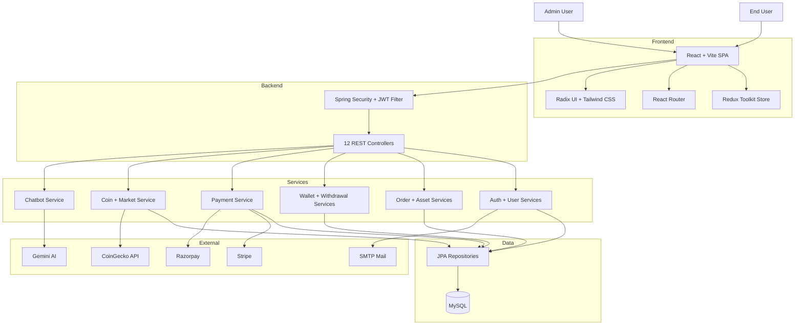
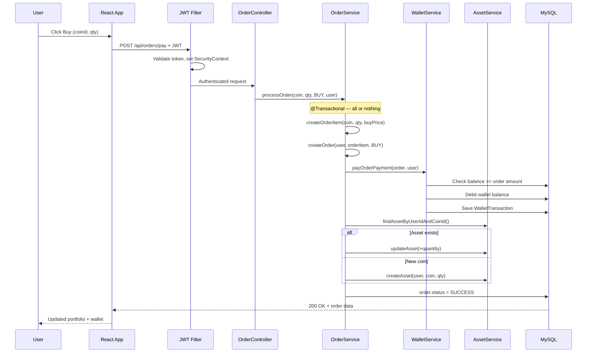
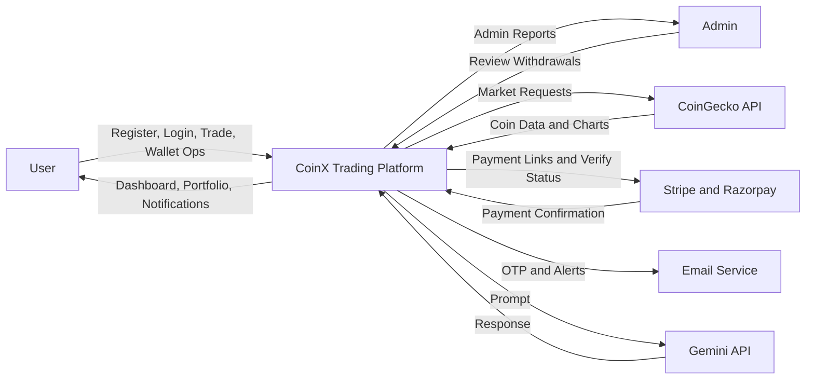
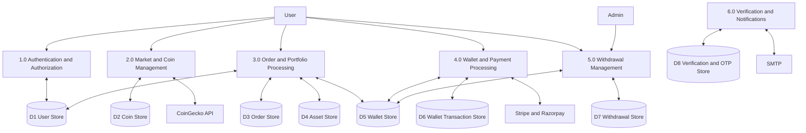
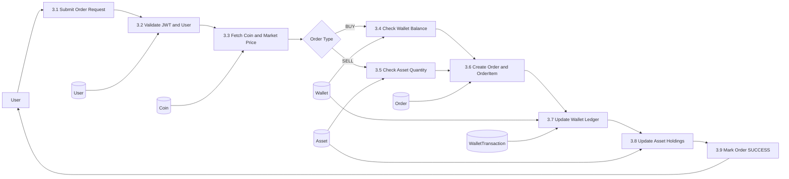
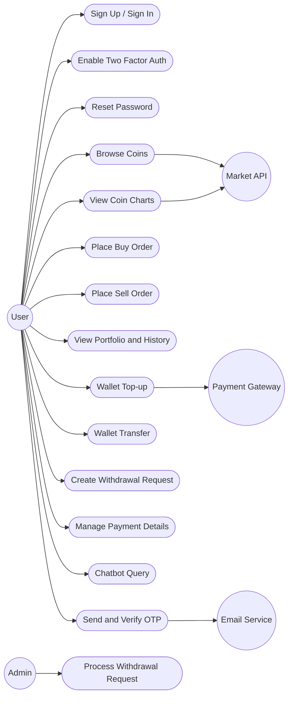
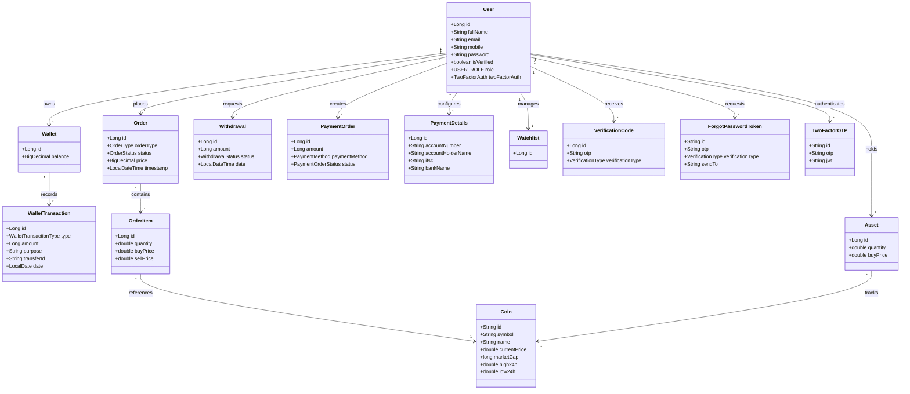
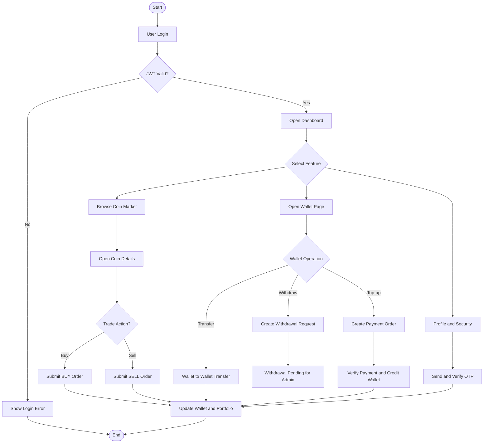
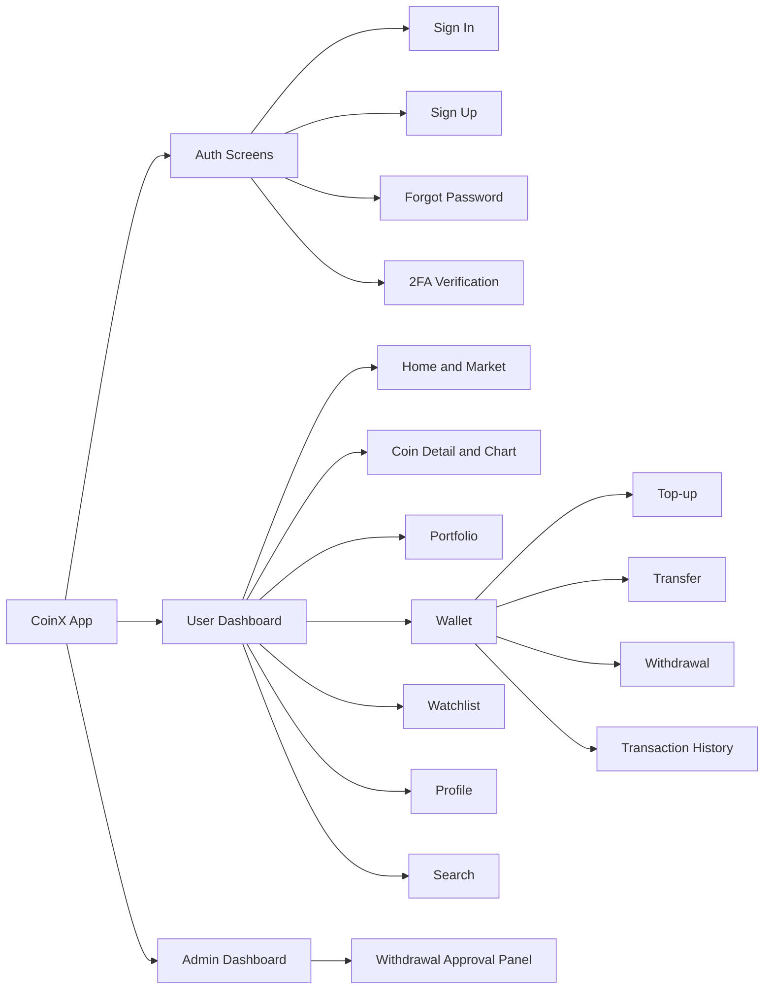

<p align="center">
  
  
  
  
  
  
  
  
</p>

# CoinX - Cryptocurrency Trading Platform

A full-stack crypto trading platform built with **Spring Boot** and **React**. Users can sign up, browse live coin markets (via CoinGecko), buy and sell crypto with real wallet debit/credit, manage wallets, track portfolio performance, and process payments through Stripe or Razorpay. Admins can approve or decline withdrawal requests.

---

## What's Inside

| Area | Details |
|---|---|
| **Backend** | 12 REST Controllers · 13 Service Interfaces · 16 Service Implementations · 17 JPA Entities |
| **Frontend** | 16 Page Modules · 7 Redux Slices · Radix UI Components · Tailwind CSS |
| **Security** | JWT (HMAC-SHA, 24h expiry) · BCrypt · OAuth2 Google Login · 2FA via Email OTP |
| **Integrations** | CoinGecko API · Stripe · Razorpay · Google Gemini (Chatbot) · SMTP Email |
| **Database** | MySQL with Spring Data JPA · `@Transactional` for atomic order processing |

---

## Table of Contents

- [Features](#features)
- [Tech Stack](#tech-stack)
- [System Architecture](#system-architecture)
- [Project Structure](#project-structure)
- [Getting Started](#getting-started)
- [Environment Variables](#environment-variables)
- [API Endpoints](#api-endpoints)
- [How It Works — Order Flow](#how-it-works--order-flow)
- [Security](#security)
- [Testing](#testing)
- [Build for Production](#build-for-production)
- [Project Report](#project-report)
- [Contributing](#contributing)
- [License](#license)

---

## Features

**Auth & Security**
- JWT-based stateless authentication with Spring Security
- OAuth2 Google login with auto-registration
- Optional two-factor authentication (email OTP)
- BCrypt password hashing
- Forgot password and account verification flows

**Trading & Portfolio**
- Live cryptocurrency prices and charts from CoinGecko
- Buy/sell orders with real wallet balance checks and atomic settlement
- Portfolio dashboard with coin holdings and buy price tracking
- Personal watchlist for tracking favorite coins
- Full order history with filtering by type and coin

**Wallet & Payments**
- Wallet balance stored as `BigDecimal` for financial precision
- Top-up via Stripe Checkout or Razorpay payment widget
- User-to-user wallet transfers with sender balance validation
- Withdrawal requests with admin approval workflow
- Every mutation logged as a `WalletTransaction` (full audit trail)

**Admin Panel**
- View all pending withdrawal requests
- Approve or decline with automatic wallet balance adjustments

**AI Chatbot**
- Coin-related Q&A powered by Google Gemini API

**UI**
- Dark mode interface with glassmorphism and gradient backgrounds
- Interactive coin charts (ApexCharts + Recharts)
- Responsive layout — works on desktop and mobile
- Toast notifications, modals, form validation

---

## Tech Stack

### Backend

| Component | Technology | Version |
|---|---|---|
| Framework | Spring Boot | 3.4.2 |
| Language | Java | 21 |
| Database | MySQL | 8+ |
| ORM | Spring Data JPA + Hibernate | — |
| Security | Spring Security + JWT (jjwt) | 0.13.0 |
| Auth | OAuth2 Client (Google) | — |
| Email | Spring Mail (SMTP) | — |
| Payments | Stripe Java SDK | 26.0.0 |
| Payments | Razorpay Java SDK | 1.4.8 |
| Caching | Caffeine Cache | — |
| Utilities | Lombok, JSON Path | — |
| Build | Maven | — |

### Frontend

| Component | Technology | Version |
|---|---|---|
| Library | React | 18.2.0 |
| Build Tool | Vite | 7.2.7 |
| State | Redux Toolkit + Redux Thunk | 2.11.2 |
| Routing | React Router DOM | 6.21.3 |
| HTTP Client | Axios | 1.6.7 |
| Styling | Tailwind CSS | 3.4.1 |
| UI Components | Radix UI (Dialog, Select, Toast, Avatar, etc.) | — |
| Charts | ApexCharts + React ApexCharts | 5.3.6 |
| Icons | Lucide React + React Icons | — |
| Forms | React Hook Form + Yup + Zod | — |

---

## System Architecture



---

## Project Structure

### Backend — `Backend-Spring boot/`

```
src/main/java/com/himanshu/
├── config/                        # Security, CORS, JWT config
│   ├── AppConfig.java             # SecurityFilterChain, CORS, BCrypt bean
│   ├── JwtProvider.java           # JWT token generation + parsing
│   ├── JwtTokenValidator.java     # OncePerRequestFilter for JWT validation
│   ├── JwtConstant.java           # Secret key constant
│   └── OAuth2SuccessHandler.java  # Google OAuth → JWT redirect
│
├── controller/                    # 12 REST controllers
│   ├── AuthController.java        # /auth — signup, signin, 2FA
│   ├── UserController.java        # /api/users — profile
│   ├── CoinController.java        # /coins — market data
│   ├── OrderController.java       # /api/orders — buy/sell
│   ├── WalletController.java      # /api/wallet — balance, deposit, transfer
│   ├── WatchlistController.java   # /api/watchlist — favorites
│   ├── WithdrawalController.java  # /api/withdrawal — create, admin approve
│   ├── PaymentController.java     # /api/payment — Stripe/Razorpay
│   ├── PaymentDetailsController.java # /api — bank details
│   ├── AssetController.java       # /api/assets — holdings
│   ├── VerificationController.java # verification endpoints
│   └── HomeController.java        # health check
│
├── model/                         # 17 JPA entities
│   ├── User.java                  # id, email, password, role, twoFactorAuth
│   ├── Wallet.java                # id, balance (BigDecimal), user
│   ├── WalletTransaction.java     # type, amount, purpose, date
│   ├── Order.java                 # orderType, status, price, timestamp
│   ├── OrderItem.java             # coin, quantity, buyPrice, sellPrice
│   ├── Coin.java                  # id, symbol, name, currentPrice
│   ├── Asset.java                 # user, coin, quantity, buyPrice
│   ├── Withdrawal.java            # amount, status, date
│   ├── PaymentOrder.java          # amount, paymentMethod, status
│   ├── PaymentDetails.java        # accountNumber, ifsc, bankName
│   ├── Watchlist.java             # user, coins
│   ├── VerificationCode.java      # otp, verificationType
│   ├── ForgotPasswordToken.java   # otp, sendTo
│   ├── TwoFactorOTP.java          # otp, jwt
│   ├── TwoFactorAuth.java         # @Embeddable — isEnabled, sendTo
│   ├── Notification.java          # notifications
│   └── TreadingHistory.java       # trading history
│
├── service/                       # 13 interfaces + 16 implementations
│   ├── OrderService.java → impl/OrderServiceImplementation.java
│   ├── WalletService.java → impl/WalleteServiceImplementation.java
│   ├── CoinService.java → impl/CoinServiceImpl.java
│   ├── UserService.java → impl/UserServiceImplementation.java
│   ├── AssetService.java → impl/AssetServiceImplementation.java
│   ├── PaymentService.java → impl/PaymentServiceImpl.java
│   ├── WithdrawalService.java → impl/WithdrawalServiceImpl.java
│   ├── WatchlistService.java → impl/WatchlistServiceImpl.java
│   ├── VerificationService.java → impl/VerificationServiceImpl.java
│   ├── ForgotPasswordService.java → impl/ForgotPasswordServiceImpl.java
│   ├── TwoFactorOtpService.java → impl/TwoFactorOtpServiceImpl.java
│   ├── PaymentDetailsService.java → impl/PaymentDetailsServiceImpl.java
│   ├── WalletTransactionService.java → impl/WalletTransactionServiceImpl.java
│   └── impl/EmailService.java, impl/CustomeUserServiceImplementation.java
│   └── impl/DataInitializationComponent.java
│
├── repository/                    # JPA repositories
├── domain/                        # Enums (OrderType, OrderStatus, etc.)
├── dto/                           # Data transfer objects
├── request/                       # Request DTOs
├── response/                      # Response DTOs
├── exception/                     # Custom exception handlers
└── utils/                         # Utility classes
```

### Frontend — `Frontend-React/`

```
src/
├── pages/
│   ├── Home/           # Dashboard with market coin cards
│   ├── Landing/        # Public landing page
│   ├── Auth/
│   │   ├── login/      # Sign in form
│   │   └── signup/     # Registration form
│   ├── StockDetails/   # Coin detail view with charts + buy/sell
│   ├── Portfolio/      # User's coin holdings
│   ├── Wallet/         # Balance, top-up, transfer, withdrawal, history
│   ├── Watchlist/      # Saved favorite coins
│   ├── Activity/       # Trading history
│   ├── Profile/        # User profile + 2FA settings
│   ├── Search/         # Coin search
│   ├── Navbar/         # Top navigation bar
│   ├── SideBar/        # Side navigation
│   ├── Footer/         # Footer
│   └── Notfound/       # 404 page
│
├── Redux/
│   ├── Store.js        # Redux store config
│   ├── Auth/AuthSlice.js       # Login, signup, profile, JWT
│   ├── Coin/CoinSlice.js       # Coin list, detail, charts, trending
│   ├── Order/OrderSlice.js     # Place order, order history
│   ├── Wallet/WalletSlice.js   # Balance, transactions, top-up
│   ├── Watchlist/WatchlistSlice.js  # Watchlist CRUD
│   ├── Withdrawal/WithdrawalSlice.js # Withdrawal requests
│   └── Assets/AssetSlice.js    # Portfolio assets
│
├── components/
│   ├── ui/             # Reusable Radix-based components
│   └── custome/        # Custom project components
│
├── Api/api.js          # Axios instance + request/response interceptors
├── Util/               # Helper functions
├── assets/             # Images, static files
└── lib/                # Utility libraries
```

---

## Getting Started

### Prerequisites

| Tool | Version |
|---|---|
| Java JDK | 21+ |
| Maven | 3.6+ |
| Node.js | 16+ |
| MySQL | 8.0+ |

### 1. Clone the repo

```bash
git clone https://github.com/himanshugupta91/CoinX-Cryptocurrency-Trading-Platform.git
cd CoinX-Cryptocurrency-Trading-Platform
```

### 2. Setup MySQL

```sql
CREATE DATABASE trading_platform;
```

### 3. Backend Setup

```bash
cd "Backend-Spring boot"
```

Create `src/main/resources/application.properties` (this file is gitignored):

```properties
# Database
spring.datasource.url=jdbc:mysql://localhost:3306/trading_platform
spring.datasource.username=root
spring.datasource.password=your_password
spring.jpa.hibernate.ddl-auto=update

# JWT
jwt.secret=your_secret_key

# Razorpay
razorpay.key.id=your_razorpay_key
razorpay.key.secret=your_razorpay_secret

# Stripe
stripe.api.key=your_stripe_key

# Email (Gmail SMTP)
spring.mail.host=smtp.gmail.com
spring.mail.port=587
spring.mail.username=your_email@gmail.com
spring.mail.password=your_app_password

# Server
server.port=5454
```

```bash
mvn clean install
mvn spring-boot:run
# Backend runs at http://localhost:5454
```

### 4. Frontend Setup

```bash
cd "Frontend-React"
npm install
npm run dev
# Frontend runs at http://localhost:5173
```

---

## Environment Variables

The `application.properties` file is excluded from git for security. You'll need to set these:

| Variable | Purpose | Where to Get |
|---|---|---|
| `spring.datasource.*` | MySQL connection | Your local MySQL |
| `razorpay.key.id` / `razorpay.key.secret` | Razorpay payments | [Razorpay Dashboard](https://dashboard.razorpay.com) |
| `stripe.api.key` | Stripe payments | [Stripe Dashboard](https://dashboard.stripe.com) |
| `spring.mail.username` / `password` | Email OTP | Gmail App Password |
| Google OAuth2 client ID/secret | Google login | [Google Cloud Console](https://console.cloud.google.com) |

---

## API Endpoints

### Auth — `/auth`
| Method | Endpoint | Description | Auth |
|---|---|---|---|
| POST | `/auth/signup` | Register new user | No |
| POST | `/auth/signin` | Login, returns JWT | No |
| POST | `/auth/two-factor/otp/{otp}` | Verify 2FA OTP | No |

### Users — `/api/users`
| Method | Endpoint | Description | Auth |
|---|---|---|---|
| GET | `/api/users/profile` | Get current user profile | JWT |
| PUT | `/api/users/profile` | Update profile | JWT |

### Coins — `/coins`
| Method | Endpoint | Description | Auth |
|---|---|---|---|
| GET | `/coins` | List coins (paginated) | No |
| GET | `/coins/{coinId}` | Coin details | No |
| GET | `/coins/search?q=` | Search coins | No |
| GET | `/coins/top50` | Top 50 by market cap | No |
| GET | `/coins/trending` | Trending coins | No |
| GET | `/coins/{coinId}/chart?days=` | Chart data | No |

### Orders — `/api/orders`
| Method | Endpoint | Description | Auth |
|---|---|---|---|
| POST | `/api/orders/pay` | Place BUY/SELL order | JWT |
| GET | `/api/orders` | User's order history | JWT |
| GET | `/api/orders/{orderId}` | Order details | JWT |

### Wallet — `/api/wallet`
| Method | Endpoint | Description | Auth |
|---|---|---|---|
| GET | `/api/wallet` | Get wallet balance | JWT |
| PUT | `/api/wallet/deposit` | Credit wallet (after payment) | JWT |
| PUT | `/api/wallet/transfer` | Transfer to another wallet | JWT |
| GET | `/api/wallet/transactions` | Transaction history | JWT |

### Assets — `/api/assets`
| Method | Endpoint | Description | Auth |
|---|---|---|---|
| GET | `/api/assets` | Get user's coin holdings | JWT |
| GET | `/api/assets/{assetId}` | Specific asset details | JWT |

### Watchlist — `/api/watchlist`
| Method | Endpoint | Description | Auth |
|---|---|---|---|
| GET | `/api/watchlist/user` | Get user's watchlist | JWT |
| POST | `/api/watchlist/add/coin/{coinId}` | Add coin to watchlist | JWT |

### Withdrawal
| Method | Endpoint | Description | Auth |
|---|---|---|---|
| POST | `/api/withdrawal/{amount}` | Create withdrawal request | JWT |
| PATCH | `/api/admin/withdrawal/{id}/proceed/{accept}` | Admin approve/decline | JWT (Admin) |
| GET | `/api/admin/withdrawal` | All withdrawal requests | JWT (Admin) |

### Payments
| Method | Endpoint | Description | Auth |
|---|---|---|---|
| POST | `/api/payment/{paymentMethod}/amount/{amount}` | Create payment link | JWT |
| GET | `/api/payment` | Verify payment callback | JWT |

---

## How It Works — Order Flow

This is the core of the project. Here's what happens when a user clicks "Buy":



**Key points:**
- The entire BUY/SELL flow is wrapped in `@Transactional` — if wallet debit fails, the order creation rolls back too
- Wallet balance is `BigDecimal`, not `double`, because floating point and money don't mix
- SELL flow checks asset quantity instead of wallet balance, and credits the wallet
- If remaining asset value drops below 1 after a sell, the asset record is deleted (no dust)
- Coin price at trade time is captured in `OrderItem.buyPrice` / `sellPrice` for accurate P&L

---

## Security

| Layer | What It Does |
|---|---|
| **JWT Filter** | `JwtTokenValidator` runs before `BasicAuthenticationFilter`, validates token on every `/api/**` request |
| **Password** | BCrypt hashing via `BCryptPasswordEncoder` — one-way, salted, adaptive |
| **2FA** | Optional email OTP — deferred JWT until OTP is verified |
| **OAuth2** | Google login → `OAuth2SuccessHandler` creates/finds user → redirects with JWT |
| **CORS** | Whitelisted origins (localhost:3000, 5173, Vercel), Authorization header exposed |
| **Session** | `STATELESS` — no server-side sessions, all state in JWT |
| **CSRF** | Disabled (stateless API, not using cookies) |
| **SQL Injection** | JPA parameterized queries |
| **XSS** | React's built-in escaping |

---

## Testing

```bash
# Backend unit + integration tests
cd "Backend-Spring boot"
./mvnw test

# Frontend linting
cd "Frontend-React"
npm run lint
```

| Test ID | Scenario | Result |
|---|---|---|
| TC-01 | Signup with valid data | Pass |
| TC-02 | Login with wrong password | Pass |
| TC-03 | BUY order with sufficient balance | Pass |
| TC-04 | BUY order with insufficient balance | Pass |
| TC-05 | Wallet top-up via payment callback | Pass |
| TC-06 | Create withdrawal request | Pass |
| TC-07 | Admin declines withdrawal | Pass |
| TC-08 | API call without JWT token | Pass |

---

## Build for Production

```bash
# Backend — produces runnable JAR
cd "Backend-Spring boot"
./mvnw clean package
java -jar target/treading-plateform-0.0.1-SNAPSHOT.jar

# Frontend — static files in dist/
cd "Frontend-React"
npm run build
```

---

## Project Report

Full academic-style documentation with chapters, diagrams, and UML.

<details>
<summary><strong>Chapter 1: Introduction</strong></summary>

### 1.1 Background
Crypto trading has gone from niche to mainstream, and users now expect more than just a basic price chart. They want secure login, live market data, order execution, portfolio tracking, and proper payment flows — all in one place. CoinX was built to bring all of these together in a full-stack application that works end to end, from user signup to order settlement.

### 1.2 Motivation
Most tutorial-level crypto projects only show one piece of the puzzle — maybe just auth, or just a chart, or just a form. They rarely show how everything connects. I wanted to build something where the auth, orders, wallet, payments, and admin workflows actually talk to each other properly. The second reason was to get hands-on with real integrations — CoinGecko for market data, Stripe and Razorpay for payments, Spring Security for JWT, and so on.

### 1.3 Problem Statement
Beginner-level crypto apps usually skip the hard parts. They'll have a trading form but no wallet debit logic, or an auth system with no real role separation. The gaps show up fast — no payment verification, no withdrawal governance, no audit trail for transactions. CoinX addresses this by connecting the dots between auth, trading, wallet, payments, and admin operations in one consistent system.

### 1.4 Objectives
Build a platform that handles the full user lifecycle: register, log in, browse coins, place buy/sell orders (with proper wallet and asset updates), top up wallet through payment gateways, request withdrawals, and let admins approve or decline those withdrawals. On the engineering side, keep things modular with proper layer separation so it's easy to extend later.

### 1.5 Scope
The project covers user and admin flows, JWT-secured APIs, market data retrieval, order processing, wallet management, payment settlement, and withdrawal handling. It doesn't cover things like high-frequency trading, institutional compliance, or distributed deployment — those are future scope.

### 1.6 Report Structure
Chapter 1 covers context and goals. Chapter 2 looks at existing systems. Chapter 3 defines requirements. Chapter 4 is all design — architecture, DFDs, UML, ER diagrams, UI. Chapter 5 covers implementation. Chapter 6 is testing. Chapter 7 discusses results. Chapter 8 wraps up with conclusions and future work.

</details>

<details>
<summary><strong>Chapter 2: Literature Review</strong></summary>

### 2.1 Introduction
Before building CoinX, I looked at what's already out there — centralized exchanges, wallet apps, portfolio trackers, and tutorial projects — to figure out where the gaps are.

### 2.2 Existing Systems
Centralized exchanges (like Binance) have deep features but their internals are opaque — hard to learn from. Wallet apps focus on custody and transfers but skip trading. Portfolio trackers give nice charts but don't execute trades. Tutorial projects usually show isolated pieces — auth without wallet logic, or trading forms without proper settlement.

### 2.3 Limitations
The biggest issue across non-enterprise projects is fragmented workflows. Auth exists but doesn't connect to trading. Orders go through but the wallet doesn't update. Transaction logs are missing. Security is half-baked — authentication without proper authorization. And most are hard to extend because the code isn't properly layered.

### 2.4 What CoinX Does Differently
CoinX treats auth, trading, wallet, payments, and admin as parts of one connected system. When you place a BUY order, the wallet actually gets debited, a transaction log is created, and the asset holding is updated — all atomically. When a withdrawal is requested, it goes to an admin queue where it can be approved or declined with proper balance adjustments.

### 2.5 Comparison

| Feature | Tracker Apps | Demo Apps | CoinX |
|---|---|---|---|
| Auth | Basic/Optional | Basic | JWT + 2FA + OAuth2 |
| Trading | No | Partial | Full buy/sell with settlement |
| Wallet | Limited | Partial | Wallet + transactions + transfers |
| Payments | No | Rare | Stripe + Razorpay |
| Admin Flow | No | No | Withdrawal approval/decline |
| Backend | API-light | Minimal | Spring Boot layered architecture |

</details>

<details>
<summary><strong>Chapter 3: System Analysis and Requirements</strong></summary>

### 3.1 Overview
React handles the UI, Spring Boot serves the REST API. Backend is split into controller, service, and repository layers. External APIs are called from dedicated service methods so the core logic doesn't get tangled with third-party code.

### 3.2 Functional Requirements
Users need to: register, sign in, browse coins, search, view charts, buy/sell, view portfolio and history, manage wallet (top-up, transfer, withdraw), manage watchlist, and use the chatbot. Admins need to: view and process withdrawal requests.

### 3.3 Non-Functional Requirements
Low latency for common operations. JWT-based security with proper token validation. Transactional consistency so wallet and order states stay in sync. Modular code so it's maintainable. Responsive UI.

### 3.4 Feasibility

**Technical**: Spring Boot and React are mature, well-documented, and have big ecosystems. CoinGecko, Stripe, Razorpay all have solid APIs. Nothing exotic here.

**Economic**: Everything is open source. External APIs have free tiers. Can run on a regular laptop for development.

**Operational**: The workflows match what users expect from a trading app. Modular design makes it manageable for a small team.

### 3.5 Requirements
- Java 21+, Maven 3.6+, Node.js 16+, MySQL 8+
- 8 GB RAM, dual-core CPU, 10 GB disk, internet connection

</details>

<details>
<summary><strong>Chapter 4: System Design</strong></summary>

### 4.1 Data Flow Diagrams

<details>
<summary>DFD Level 0</summary>



</details>

<details>
<summary>DFD Level 1</summary>



</details>

<details>
<summary>DFD Level 2 — Order Execution</summary>



</details>

### 4.2 UML Diagrams

<details>
<summary>Use Case Diagram</summary>



</details>

<details>
<summary>Class Diagram</summary>



</details>

<details>
<summary>Activity Diagram</summary>



</details>

### 4.3 Database Design

<details>
<summary>ER Diagram</summary>


</details>

<details>
<summary>Data Dictionary</summary>

| Table | Field | Type | Constraints | Description |
|---|---|---|---|---|
| `user` | `id` | BIGINT | PK, Auto Increment | Unique user identifier |
| `user` | `email` | VARCHAR | Unique, Not Null | Login email |
| `user` | `password` | VARCHAR | Not Null | BCrypt-hashed |
| `user` | `role` | VARCHAR | Not Null | ROLE_USER or ROLE_ADMIN |
| `user` | `is_verified` | BOOLEAN | Default false | Account verification status |
| `wallet` | `id` | BIGINT | PK | Wallet identifier |
| `wallet` | `user_id` | BIGINT | FK -> user.id | Owner |
| `wallet` | `balance` | DECIMAL | Not Null | Current balance |
| `wallet_transaction` | `id` | BIGINT | PK | Transaction ID |
| `wallet_transaction` | `wallet_id` | BIGINT | FK -> wallet.id | Parent wallet |
| `wallet_transaction` | `type` | VARCHAR | Not Null | Deposit, withdrawal, transfer, buy, sell |
| `wallet_transaction` | `amount` | BIGINT | Not Null | Signed amount |
| `wallet_transaction` | `txn_date` | DATE | Not Null | Transaction date |
| `coin` | `id` | VARCHAR | PK | Coin slug (e.g. bitcoin) |
| `coin` | `symbol` | VARCHAR | Indexed | Ticker symbol |
| `coin` | `current_price` | DOUBLE | Not Null | Latest price |
| `order` | `id` | BIGINT | PK | Order ID |
| `order` | `user_id` | BIGINT | FK -> user.id | Who placed it |
| `order` | `order_type` | VARCHAR | Not Null | BUY or SELL |
| `order` | `status` | VARCHAR | Not Null | PENDING, SUCCESS, CANCELLED |
| `order` | `price` | DECIMAL | Not Null | Total order value |
| `order_item` | `coin_id` | VARCHAR | FK -> coin.id | Which coin |
| `order_item` | `quantity` | DOUBLE | Not Null | How much |
| `asset` | `user_id` | BIGINT | FK -> user.id | Owner |
| `asset` | `coin_id` | VARCHAR | FK -> coin.id | Which coin |
| `asset` | `quantity` | DOUBLE | Not Null | Units held |
| `withdrawal` | `amount` | BIGINT | Not Null | Requested amount |
| `withdrawal` | `status` | VARCHAR | Not Null | PENDING, SUCCESS, DECLINE |
| `payment_order` | `payment_method` | VARCHAR | Not Null | STRIPE or RAZORPAY |

</details>

### 4.4 UI Navigation

<details>
<summary>Navigation Diagram</summary>



</details>

</details>

<details>
<summary><strong>Chapter 5: Implementation</strong></summary>

### 5.1 Dev Environment
Backend: Java 21, Spring Boot 3.4.2, Maven. Frontend: React 18.2, Vite 7.2. Database: MySQL 8. Works on Windows, macOS, or Linux with IntelliJ or VS Code.

### 5.2 Tech Used
**Backend**: Spring Boot for the API, Spring Security + JWT for auth, Spring Data JPA for database, Spring Mail for OTP emails, OAuth2 for Google login, Caffeine for caching. **Frontend**: React for components, Redux Toolkit for state, React Router for navigation, Axios for HTTP, Tailwind + Radix UI for styling. **External**: CoinGecko (market data), Stripe + Razorpay (payments), Gemini (chatbot).

### 5.3 Modules
- **Auth**: signup, signin, JWT, 2FA, password reset
- **Coin**: listing, detail, search, trending, charts (from CoinGecko)
- **Order**: buy/sell processing, order history, cancellation
- **Wallet**: balance, top-up, transfer, withdrawal, transaction log
- **Withdrawal**: user creates request → admin approves/declines
- **Watchlist**: add/remove favorite coins
- **Chat**: Gemini-powered coin Q&A

### 5.4 Key Logic
JWT generation uses HMAC-SHA signing with 24h expiry. OTP is a random 6-digit code stored in DB and sent via email. BUY flow checks wallet balance before debiting. SELL flow checks asset quantity before crediting. Wallet transfers validate sender balance. All order operations use `@Transactional` for atomicity.

### 5.5 Code Snippets

```java
// JWT generation in JwtProvider.java
String jwt = Jwts.builder()
    .setIssuedAt(new Date())
    .setExpiration(new Date(new Date().getTime() + 86400000))
    .claim("email", auth.getName())
    .claim("authorities", roles)
    .signWith(key)
    .compact();
```

```javascript
// Fetching coin list in CoinSlice.js
const response = await axios.get(`${API_BASE_URL}/coins?page=${page}`);
dispatch({ type: FETCH_COIN_LIST_SUCCESS, payload: response.data });
```

</details>

<details>
<summary><strong>Chapter 6: Testing</strong></summary>

### 6.1 Strategy
Unit tests for individual service methods. Integration tests for API flows (order + wallet + asset updates together). Manual end-to-end testing for complete user journeys.

### 6.2 Unit Testing
Backend: testing order processing logic, wallet mutation rules, verification checks. Frontend: reducer tests, utility helpers, action dispatch behavior.

### 6.3 Integration Testing
Key scenarios: authenticated endpoint access, order creation with wallet/asset sync, payment → wallet credit, withdrawal lifecycle (create → admin approve/decline).

### 6.4 System Testing
Full user journey: signup → login → browse market → trade → wallet top-up → withdrawal → admin handling.

</details>

<details>
<summary><strong>Chapter 7: Results</strong></summary>

### 7.1 What Was Built
Complete screens for auth (signup, signin, 2FA, password reset), dashboard with market cards, coin detail with charts and trading forms, wallet with top-up/transfer/withdrawal/history, portfolio, and admin withdrawal panel.

### 7.2 Performance
Works well for development and prototype usage. API responses are quick for typical loads. The slowest parts are external API calls (CoinGecko, Gemini) — those depend on network and provider quotas.

### 7.3 Compared to Others
Unlike most student projects, CoinX actually connects all the pieces. An order isn't just a form submission — it triggers wallet updates, asset changes, and transaction logging in one atomic operation. That's closer to how real exchanges work.

</details>

<details>
<summary><strong>Chapter 8: Conclusion</strong></summary>

### 8.1 Summary
CoinX does what it set out to do — a working crypto trading platform with proper auth, trading, wallet management, payment integration, and admin governance. The code is modular enough to extend without major rewrites.

### 8.2 Limitations
Depends on third-party APIs (CoinGecko can be slow, payment gateways have quotas). No automated test suite beyond unit tests. Not designed for high-frequency trading or institutional use.

### 8.3 Future Work
Redis caching for coin data, RabbitMQ for order processing, Docker + Kubernetes for deployment, CI/CD with GitHub Actions, Stripe webhook signature validation, rate limiting on auth endpoints, and monitoring with Prometheus + Grafana.

</details>

<details>
<summary><strong>References</strong></summary>

1. Spring Boot — https://spring.io/projects/spring-boot  
2. Spring Security — https://spring.io/projects/spring-security  
3. React — https://react.dev  
4. Redux Toolkit — https://redux-toolkit.js.org  
5. Vite — https://vitejs.dev  
6. CoinGecko API — https://www.coingecko.com/en/api/documentation  
7. Stripe API — https://docs.stripe.com  
8. Razorpay API — https://razorpay.com/docs  
9. Mermaid — https://mermaid.js.org  

</details>

<details>
<summary><strong>Appendices</strong></summary>

### A. Source Code
Backend code is in `Backend-Spring boot/`. Frontend code is in `Frontend-React/`.

### B. User Manual
Setup instructions are in the Getting Started section above. Frontend-specific notes are in `Frontend-React/README.md`.

### C. Publication
Reserved for future publications, conference submissions, or institutional repository links.

</details>

---

## Contributing

1. Fork the repo
2. Create a branch (`git checkout -b feature/something`)
3. Commit your changes (`git commit -m 'add something'`)
4. Push (`git push origin feature/something`)
5. Open a Pull Request

---

## License

MIT License. See LICENSE file for details.
