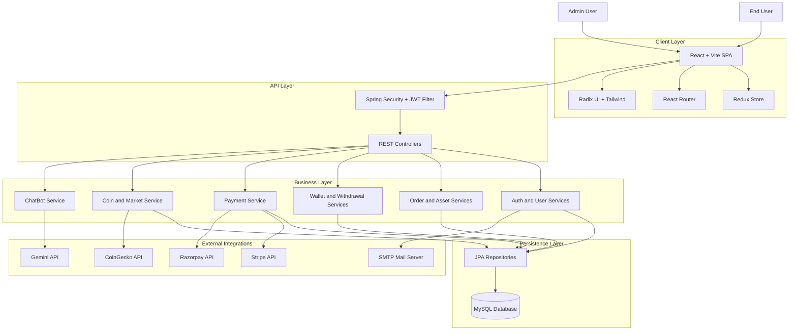
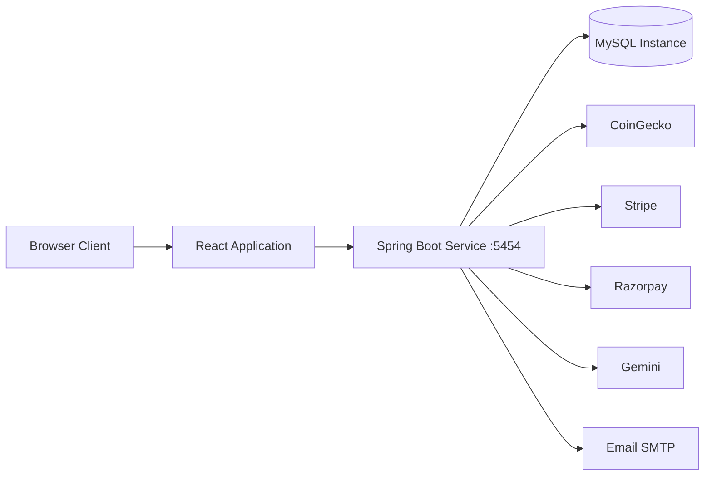
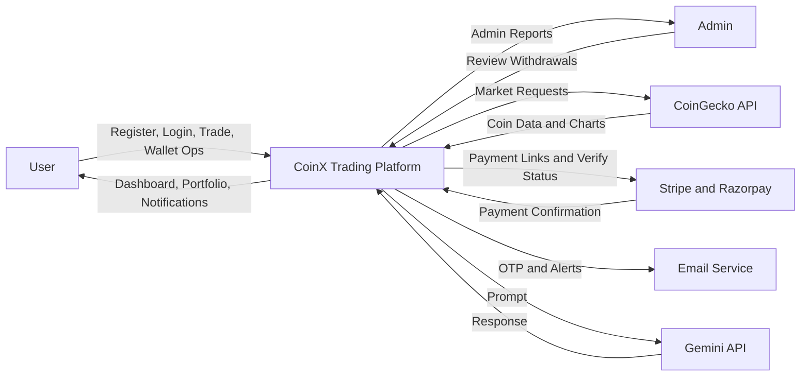
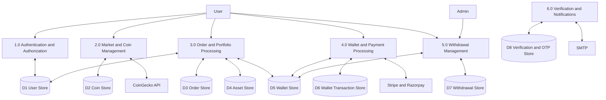
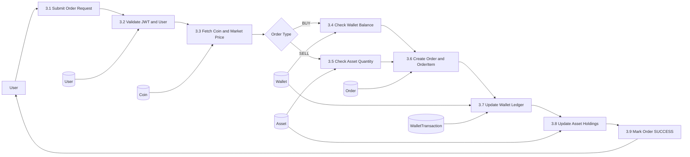
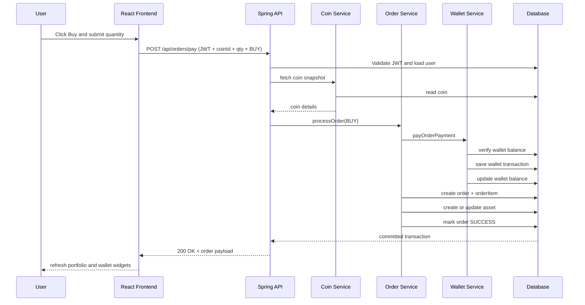
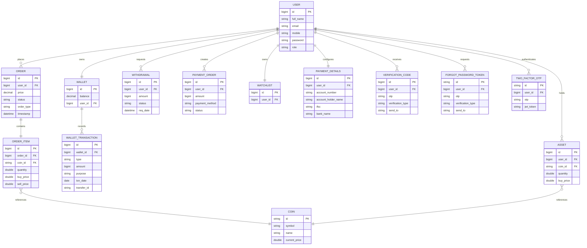
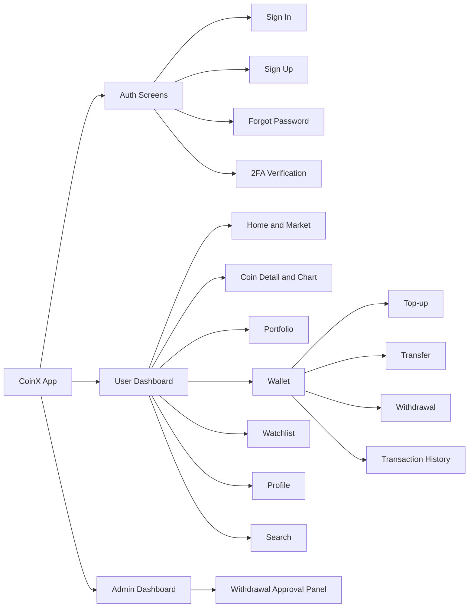

# CoinX - Cryptocurrency Trading Platform

A crypto trading platform I built with **Spring Boot** (backend) and **React** (frontend). Think of it as a simplified Binance — users can browse live coin markets, buy/sell crypto, manage their wallet, track portfolio, and process payments through Stripe or Razorpay.

---

## Project Report

This section covers the project in report format.

<details>
<summary><strong>Chapter 1: Introduction</strong></summary>

### 1.1 Background
Crypto trading has gone from niche to mainstream, and users now expect more than just a basic price chart. They want secure login, live market data, order execution, portfolio tracking, and proper payment flows — all in one place. CoinX was built to bring all of these together in a full-stack application that works end to end, from user signup to order settlement.

### 1.2 Motivation
Most tutorial-level crypto projects only show one piece of the puzzle — maybe just auth, or just a chart, or just a form. They rarely show how everything connects. I wanted to build something where the auth, orders, wallet, payments, and admin workflows actually talk to each other properly. The second reason was to get hands-on with real integrations — CoinGecko for market data, Stripe and Razorpay for payments, Spring Security for JWT, and so on.

### 1.3 Problem Statement
Beginner-level crypto apps usually skip the hard parts. They'll have a trading form but no wallet debit logic, or an auth system with no real role separation. The gaps show up fast — no payment verification, no withdrawal governance, no audit trail for transactions. CoinX addresses this by connecting the dots between auth, trading, wallet, payments, and admin operations in one consistent system.

### 1.4 Objectives
Build a platform that handles the full user lifecycle: register, log in, browse coins, place buy/sell orders (with proper wallet and asset updates), top up wallet through payment gateways, request withdrawals, and let admins approve or decline those withdrawals. On the engineering side, keep things modular with proper layer separation so it's easy to extend later.

### 1.5 Scope
The project covers user and admin flows, JWT-secured APIs, market data retrieval, order processing, wallet management, payment settlement, and withdrawal handling. It doesn't cover things like high-frequency trading, institutional compliance, or distributed deployment — those are future scope.

### 1.6 Report Structure
Chapter 1 covers context and goals. Chapter 2 looks at existing systems. Chapter 3 defines requirements. Chapter 4 is all design — architecture, DFDs, UML, ER diagrams, UI. Chapter 5 covers implementation. Chapter 6 is testing. Chapter 7 discusses results. Chapter 8 wraps up with conclusions and future work.

</details>

<details>
<summary><strong>Chapter 2: Literature Review</strong></summary>

### 2.1 Introduction
Before building CoinX, I looked at what's already out there — centralized exchanges, wallet apps, portfolio trackers, and tutorial projects — to figure out where the gaps are.

### 2.2 Existing Systems
Centralized exchanges (like Binance) have deep features but their internals are opaque — hard to learn from. Wallet apps focus on custody and transfers but skip trading. Portfolio trackers give nice charts but don't execute trades. Tutorial projects usually show isolated pieces — auth without wallet logic, or trading forms without proper settlement.

### 2.3 Limitations
The biggest issue across non-enterprise projects is fragmented workflows. Auth exists but doesn't connect to trading. Orders go through but the wallet doesn't update. Transaction logs are missing. Security is half-baked — authentication without proper authorization. And most are hard to extend because the code isn't properly layered.

### 2.4 What CoinX Does Differently
CoinX treats auth, trading, wallet, payments, and admin as parts of one connected system. When you place a BUY order, the wallet actually gets debited, a transaction log is created, and the asset holding is updated — all atomically. When a withdrawal is requested, it goes to an admin queue where it can be approved or declined with proper balance adjustments.

### 2.5 Comparison

| Feature | Tracker Apps | Demo Apps | CoinX |
|---|---|---|---|
| Auth | Basic/Optional | Basic | JWT + 2FA + OAuth2 |
| Trading | No | Partial | Full buy/sell with settlement |
| Wallet | Limited | Partial | Wallet + transactions + transfers |
| Payments | No | Rare | Stripe + Razorpay |
| Admin Flow | No | No | Withdrawal approval/decline |
| Backend | API-light | Minimal | Spring Boot layered architecture |

</details>

<details>
<summary><strong>Chapter 3: System Analysis and Requirements</strong></summary>

### 3.1 Overview
React handles the UI, Spring Boot serves the REST API. Backend is split into controller, service, and repository layers. External APIs are called from dedicated service methods so the core logic doesn't get tangled with third-party code.

### 3.2 Functional Requirements
Users need to: register, sign in, browse coins, search, view charts, buy/sell, view portfolio and history, manage wallet (top-up, transfer, withdraw), manage watchlist, and use the chatbot. Admins need to: view and process withdrawal requests.

### 3.3 Non-Functional Requirements
Low latency for common operations. JWT-based security with proper token validation. Transactional consistency so wallet and order states stay in sync. Modular code so it's maintainable. Responsive UI.

### 3.4 Feasibility

**Technical**: Spring Boot and React are mature, well-documented, and have big ecosystems. CoinGecko, Stripe, Razorpay all have solid APIs. Nothing exotic here.

**Economic**: Everything is open source. External APIs have free tiers. Can run on a regular laptop for development.

**Operational**: The workflows match what users expect from a trading app. Modular design makes it manageable for a small team.

### 3.5 Requirements
- Java 17+, Maven 3.6+, Node.js 16+, MySQL 8+
- 8 GB RAM, dual-core CPU, 10 GB disk, internet connection

</details>

<details>
<summary><strong>Chapter 4: System Design</strong></summary>

### 4.1 System Architecture





### 4.2 Data Flow Diagrams

<details>
<summary>DFD Level 0</summary>



</details>

<details>
<summary>DFD Level 1</summary>



</details>

<details>
<summary>DFD Level 2 — Order Execution</summary>



</details>

### 4.3 UML Diagrams

<details>
<summary>Use Case Diagram</summary>


</details>

<details>
<summary>Class Diagram</summary>


</details>

<details>
<summary>Sequence Diagram — Buy Order</summary>



</details>

<details>
<summary>Activity Diagram</summary>


</details>

### 4.4 Database Design

<details>
<summary>ER Diagram</summary>



</details>

<details>
<summary>Data Dictionary</summary>

| Table | Field | Type | Constraints | Description |
|---|---|---|---|---|
| `user` | `id` | BIGINT | PK, Auto Increment | Unique user identifier |
| `user` | `email` | VARCHAR | Unique, Not Null | Login email |
| `user` | `password` | VARCHAR | Not Null | BCrypt-hashed |
| `user` | `role` | VARCHAR | Not Null | ROLE_USER or ROLE_ADMIN |
| `user` | `is_verified` | BOOLEAN | Default false | Account verification status |
| `wallet` | `id` | BIGINT | PK | Wallet identifier |
| `wallet` | `user_id` | BIGINT | FK -> user.id | Owner |
| `wallet` | `balance` | DECIMAL | Not Null | Current balance |
| `wallet_transaction` | `id` | BIGINT | PK | Transaction ID |
| `wallet_transaction` | `wallet_id` | BIGINT | FK -> wallet.id | Parent wallet |
| `wallet_transaction` | `type` | VARCHAR | Not Null | Deposit, withdrawal, transfer, buy, sell |
| `wallet_transaction` | `amount` | BIGINT | Not Null | Signed amount |
| `wallet_transaction` | `txn_date` | DATE | Not Null | Transaction date |
| `coin` | `id` | VARCHAR | PK | Coin slug (e.g. bitcoin) |
| `coin` | `symbol` | VARCHAR | Indexed | Ticker symbol |
| `coin` | `current_price` | DOUBLE | Not Null | Latest price |
| `order` | `id` | BIGINT | PK | Order ID |
| `order` | `user_id` | BIGINT | FK -> user.id | Who placed it |
| `order` | `order_type` | VARCHAR | Not Null | BUY or SELL |
| `order` | `status` | VARCHAR | Not Null | PENDING, SUCCESS, CANCELLED |
| `order` | `price` | DECIMAL | Not Null | Total order value |
| `order_item` | `coin_id` | VARCHAR | FK -> coin.id | Which coin |
| `order_item` | `quantity` | DOUBLE | Not Null | How much |
| `asset` | `user_id` | BIGINT | FK -> user.id | Owner |
| `asset` | `coin_id` | VARCHAR | FK -> coin.id | Which coin |
| `asset` | `quantity` | DOUBLE | Not Null | Units held |
| `withdrawal` | `amount` | BIGINT | Not Null | Requested amount |
| `withdrawal` | `status` | VARCHAR | Not Null | PENDING, SUCCESS, DECLINE |
| `payment_order` | `payment_method` | VARCHAR | Not Null | STRIPE or RAZORPAY |

</details>

### 4.5 UI Design

<details>
<summary>UI Navigation</summary>



The UI uses a dashboard layout with top navigation. Loading/success/error states are shown clearly. Forms validate input before submission. Admin-only routes are hidden from regular users. Everything is responsive via Tailwind.

</details>

</details>

<details>
<summary><strong>Chapter 5: Implementation</strong></summary>

### 5.1 Dev Environment
Backend: Java 17, Spring Boot, Maven. Frontend: React 18, Vite (fast HMR). Database: MySQL 8. Works on Windows, macOS, or Linux with IntelliJ or VS Code.

### 5.2 Tech Used
**Backend**: Spring Boot for the API, Spring Security + JWT for auth, Spring Data JPA for database, Spring Mail for OTP emails, OAuth2 for Google login. **Frontend**: React for components, Redux for state, React Router for navigation, Axios for HTTP, Tailwind + Radix UI for styling. **External**: CoinGecko (market data), Stripe + Razorpay (payments), Gemini (chatbot).

### 5.3 Modules
- **Auth**: signup, signin, JWT, 2FA, password reset
- **Coin**: listing, detail, search, trending, charts (from CoinGecko)
- **Order**: buy/sell processing, order history, cancellation
- **Wallet**: balance, top-up, transfer, withdrawal, transaction log
- **Withdrawal**: user creates request → admin approves/declines
- **Watchlist**: add/remove favorite coins
- **Chat**: Gemini-powered coin Q&A

### 5.4 Key Logic
JWT generation uses HMAC-SHA signing with 24h expiry. OTP is a random 6-digit code stored in DB and sent via email. BUY flow checks wallet balance before debiting. SELL flow checks asset quantity before crediting. Wallet transfers validate sender balance. All order operations use `@Transactional` for atomicity.

### 5.5 Code Snippets

```java
// JWT generation
String jwt = Jwts.builder()
    .setIssuedAt(new Date())
    .setExpiration(new Date(new Date().getTime() + 86400000))
    .claim("email", auth.getName())
    .claim("authorities", roles)
    .signWith(key)
    .compact();
```

```javascript
// Fetching coin list
const response = await axios.get(`${API_BASE_URL}/coins?page=${page}`);
dispatch({ type: FETCH_COIN_LIST_SUCCESS, payload: response.data });
```

</details>

<details>
<summary><strong>Chapter 6: Testing</strong></summary>

### 6.1 Strategy
Unit tests for individual service methods. Integration tests for API flows (order + wallet + asset updates together). Manual end-to-end testing for complete user journeys.

### 6.2 Unit Testing
Backend: testing order processing logic, wallet mutation rules, verification checks. Frontend: reducer tests, utility helpers, action dispatch behavior.

### 6.3 Integration Testing
Key scenarios: authenticated endpoint access, order creation with wallet/asset sync, payment → wallet credit, withdrawal lifecycle (create → admin approve/decline).

### 6.4 System Testing
Full user journey: signup → login → browse market → trade → wallet top-up → withdrawal → admin handling.

### 6.5 Test Results

| Test | Scenario | Expected | Status |
|---|---|---|---|
| TC-01 | Signup with valid data | Account created, JWT returned | Pass |
| TC-02 | Wrong password login | Auth failure message | Pass |
| TC-03 | BUY with enough balance | Order success, wallet debited | Pass |
| TC-04 | BUY with low balance | Error, no state change | Pass |
| TC-05 | Wallet top-up callback | Balance increased | Pass |
| TC-06 | Create withdrawal | Saved as pending | Pass |
| TC-07 | Admin declines withdrawal | Amount refunded | Pass |
| TC-08 | API call without token | 401/403 response | Pass |

</details>

<details>
<summary><strong>Chapter 7: Results</strong></summary>

### 7.1 What Was Built
Complete screens for auth (signup, signin, 2FA, password reset), dashboard with market cards, coin detail with charts and trading forms, wallet with top-up/transfer/withdrawal/history, portfolio, and admin withdrawal panel.

### 7.2 Performance
Works fine for development and prototype usage. API responses are quick for typical loads. The slowest parts are external API calls (CoinGecko, Gemini) — those depend on network and provider quotas.

### 7.3 Compared to Others
Unlike most student projects, CoinX actually connects all the pieces. An order isn't just a form submission — it triggers wallet updates, asset changes, and transaction logging in one atomic operation. That's closer to how real exchanges work.

</details>

<details>
<summary><strong>Chapter 8: Conclusion</strong></summary>

### 8.1 Summary
CoinX does what it set out to do — a working crypto trading platform with proper auth, trading, wallet management, payment integration, and admin governance. The code is modular enough to extend without major rewrites.

### 8.2 Limitations
Depends on third-party APIs (CoinGecko can be slow, payment gateways have quotas). No automated test suite beyond unit tests. Not designed for high-frequency trading or institutional use.

### 8.3 Future Work
Redis caching for coin data, RabbitMQ for order processing, Docker + Kubernetes for deployment, CI/CD with GitHub Actions, Stripe webhook signature validation, rate limiting on auth endpoints, and proper monitoring with Prometheus + Grafana.

</details>

<details>
<summary><strong>References</strong></summary>

1. Spring Boot — https://spring.io/projects/spring-boot  
2. Spring Security — https://spring.io/projects/spring-security  
3. React — https://react.dev  
4. Redux — https://redux.js.org  
5. Vite — https://vitejs.dev  
6. CoinGecko API — https://www.coingecko.com/en/api/documentation  
7. Stripe API — https://docs.stripe.com  
8. Razorpay API — https://razorpay.com/docs  
9. Mermaid — https://mermaid.js.org  

</details>

<details>
<summary><strong>Appendices</strong></summary>

### A. Source Code
Backend code is in `Backend-Spring boot/`. Frontend code is in `Frontend-React/`.

### B. User Manual
Setup instructions are in this README. Frontend-specific notes are in `Frontend-React/README.md`.

### C. Publication
Reserved for future publications, conference submissions, or institutional repository links.

</details>

---

<details>
<summary><strong>Features</strong></summary>

**Auth & Security**
- JWT authentication with Spring Security
- OAuth2 Google login
- Two-factor auth (email OTP)
- BCrypt password hashing

**Trading**
- Live coin prices from CoinGecko
- Buy/sell with real wallet debit/credit
- Portfolio with profit/loss tracking
- Watchlist for favorite coins
- Order history

**Wallet & Payments**
- Wallet balance management
- Top-up via Stripe or Razorpay
- User-to-user transfers
- Withdrawal requests (admin-approved)
- Full transaction history

**UI**
- Charts with ApexCharts and Recharts
- Dark mode, glassmorphism, gradient backgrounds
- Responsive layout with Tailwind

**Admin**
- Withdrawal approval/decline panel

</details>

---

<details>
<summary><strong>Tech Stack</strong></summary>

**Backend**
- Spring Boot 3.2.4, Java 17
- MySQL, Spring Data JPA
- Spring Security + JWT
- Maven
- Stripe SDK, Razorpay SDK, Lombok

**Frontend**
- React 18.2, Vite 5.0
- Redux + Redux Thunk
- React Router 6.21
- Axios
- Tailwind CSS 3.4, Radix UI
- ApexCharts, Recharts
- React Hook Form + Yup/Zod

</details>

---

<details>
<summary><strong>Project Structure</strong></summary>

**Backend**
```
Backend-Spring boot/
├── src/main/java/com/himanshu/
│   ├── config/           # Security, CORS, JWT
│   ├── controller/       # 12 REST controllers
│   ├── domain/           # Enums
│   ├── dto/              # Data transfer objects
│   ├── exception/        # Error handlers
│   ├── model/            # 17 JPA entities
│   ├── repository/       # JPA repositories
│   ├── request/          # Request DTOs
│   ├── response/         # Response DTOs
│   ├── service/          # 13 interfaces + 16 implementations
│   └── utils/            # Helpers
└── pom.xml
```

**Frontend**
```
Frontend-React/
├── src/
│   ├── pages/            # Home, Auth, Portfolio, Wallet, etc.
│   ├── Redux/            # 7 slices (Auth, Coin, Order, Wallet, ...)
│   ├── components/       # UI + custom components
│   ├── Api/api.js        # Axios config
│   ├── Util/             # Utilities
│   └── assets/           # Static files
├── package.json
├── vite.config.js
└── tailwind.config.js
```

</details>

---

<details>
<summary><strong>Getting Started</strong></summary>

**Prerequisites**: Java 17+, Node.js 16+, MySQL 8+, Maven 3.6+

**Backend**
```bash
cd "Backend-Spring boot"

# Create your application.properties (not tracked in git):
# spring.datasource.url=jdbc:mysql://localhost:3306/trading_platform
# spring.datasource.username=your_user
# spring.datasource.password=your_pass
# + Stripe, Razorpay, SMTP keys

mvn clean install
mvn spring-boot:run
# runs on http://localhost:5454
```

**Frontend**
```bash
cd "Frontend-React"
npm install
npm run dev
# runs on http://localhost:5173
```

</details>

---

<details>
<summary><strong>API Endpoints</strong></summary>

**Auth**
- `POST /auth/signup` — register
- `POST /auth/signin` — login
- `POST /auth/verify-otp` — 2FA verification

**Users**
- `GET /api/users/profile` — get profile
- `PUT /api/users/profile` — update profile

**Coins**
- `GET /api/coins` — list coins
- `GET /api/coins/{id}` — coin detail
- `GET /api/coins/search` — search

**Orders**
- `POST /api/orders` — place order
- `GET /api/orders` — user's orders
- `GET /api/orders/{id}` — order detail

**Wallet**
- `GET /api/wallet` — balance
- `POST /api/wallet/deposit` — deposit
- `POST /api/wallet/withdraw` — withdraw
- `GET /api/wallet/transactions` — history

**Watchlist**
- `GET /api/watchlist` — get watchlist
- `POST /api/watchlist/{coinId}` — add coin
- `DELETE /api/watchlist/{coinId}` — remove coin

**Payments**
- `POST /api/payment/razorpay` — create Razorpay order
- `POST /api/payment/stripe` — create Stripe session

</details>

---

<details>
<summary><strong>Testing</strong></summary>

```bash
# Backend
cd "Backend-Spring boot"
./mvnw test

# Frontend
cd "Frontend-React"
npm run lint
```

</details>

---

<details>
<summary><strong>Build for Production</strong></summary>

```bash
# Backend
cd "Backend-Spring boot"
./mvnw clean package
java -jar target/treading-plateform-0.0.1-SNAPSHOT.jar

# Frontend
cd "Frontend-React"
npm run build
# output in dist/
```

</details>

---

<details>
<summary><strong>Security</strong></summary>

- JWT for stateless auth
- BCrypt for password hashing
- CORS configured for known origins
- Server-side input validation
- JPA parameterized queries (no SQL injection)
- React's built-in XSS protection
- Optional 2FA via email OTP

</details>

---

<details>
<summary><strong>Contributing</strong></summary>

1. Fork the repo
2. Create a branch (`git checkout -b feature/something`)
3. Commit (`git commit -m 'add something'`)
4. Push (`git push origin feature/something`)
5. Open a PR

</details>

---

<details>
<summary><strong>License</strong></summary>

MIT License. See LICENSE file.

</details>

---
